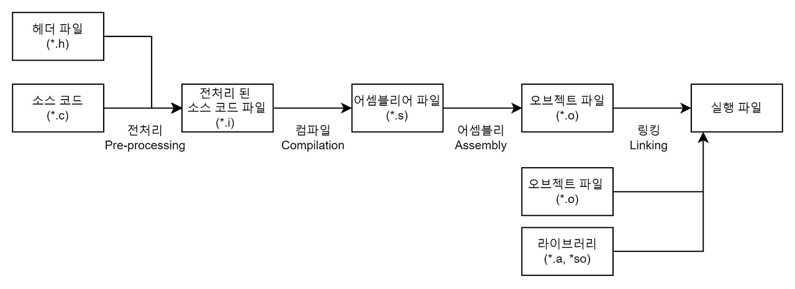
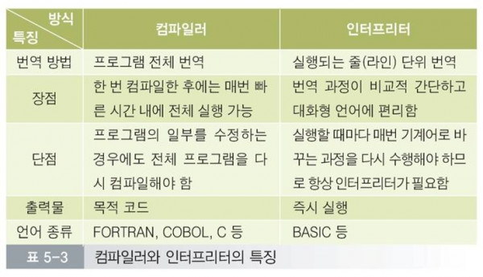

# 프로그래밍

- 컴퓨터에게 실행을 요구하는 일종의 **커뮤니케이션**
- 정확하고 상세하게 **요구사항을 설명**하는 작업

## 프로그래밍 언어

- 컴퓨터와 대화에 사용되는 일종의 표현 수단으로 사람과 컴퓨터 모두 이해 가능한 **인공어**

- 프로그래밍 언어는 구문과 **의미**의 **조합**으로 표현

- 프로그래밍 언어는 **컴파일러**와 **인터프리터**로 나눔

### 컴파일

- 좁은 의미: 특정 프로그램 소스 코드를 기계어로 변환하는 것

- 넓은 의미: 특정 프로그램 소스 코드를 다른 언어(혹은 형태)로 변환하는 것
- 전체 파일을 스캔하여 **한꺼번**에 번역한다.
- 초기 스캔시간이 오래 걸리지만, 한번 실행 파일이 만들어지고 나면 빠르다.
- 기계어 번역과정에서 더 많은 메모리를 사용한다.
- 전체 코드를 스캔하는 과정에서 모든 오류를 한꺼번에 출력해주기 때문에 **실행 전에 오류를 알 수 있다**.
- 대표적인 언어로 C, C++, JAVA 등이 있다.
- 
- 4가지 단계(전처리 과정 - 컴파일 과정 - 어셈블리 과정 - 링킹 과정)

### 인터프리트

- 프로그램 실행시 **한 번에 한 문장씩** 번역한다.
- 한번에 한문장씩 번역후 실행 시키기 때문에 실행 시간이 느리다.
- 컴파일러와 같은 오브젝트 코드 생성과정이 없기 때문에 메모리 효율이 좋다.
- 프로그램을 실행시키고 나서 오류를 발견하면 바로 실행을 중지 시킨다. **실행 후에 오류를 알 수 있다.**
- 대표적인 언어로 Python, Ruby, Javascript 등이 있다.
- 컴파일러와 다르게 목적코드를 만들지 않고, 링킹 과정도 없다.

### 컴파일러와 인터프리터 차이

