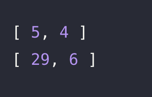

# 🔖  분수의 덧셈

## `📌 문제`

###### 문제 설명

첫 번째 분수의 분자와 분모를 뜻하는 `denum1`, `num1`, 두 번째 분수의 분자와 분모를 뜻하는 `denum2`, `num2`가 매개변수로 주어집니다. 두 분수를 더한 값을 기약 분수로 나타냈을 때 분자와 분모를 순서대로 담은 배열을 return 하도록 solution 함수를 완성해보세요.

------

##### 제한사항

- 0 <`denum1`, `num1`, `denum2`, `num2` < 1,000

------

##### 입출력 예

| denum1 | num1 | denum2 | num2 | result  |
| ------ | ---- | ------ | ---- | ------- |
| 1      | 2    | 3      | 4    | [5, 4]  |
| 9      | 2    | 1      | 3    | [29, 6] |

------

##### 입출력 예 설명

입출력 예 #1

- 1 / 2 + 3 / 4 = 5 / 4입니다. 따라서 [5, 4]를 return 합니다.

입출력 예 #2

- 9 / 2 + 1 / 3 = 29 / 6입니다. 따라서 [29, 6]을 return 합니다.


## `✏️ 풀이`

```javascript
function solution(denum1, num1, denum2, num2) {
    var answer = [];
    // 분자
    let nomerator = (denum1 * num2) + (denum2 * num1);
    // 분모
    let denominator = num1 * num2;
    // 최소 공배수
    let lcm = 1
    
    // 약분
    for(let i = 1 ; i <= nomerator ; i++) {
        if((nomerator%i === 0) && (denominator%i === 0)) {
            lcm = i;
            console.log(lcm);
        }
    }
  	
  	// answer 배열에 push로 분자와 분모 추가
    answer.push(nomerator/lcm);
    answer.push(denominator/lcm);
    return answer;
}
```

> 기약 분수의 덧셈에서 순서대로 a, b, c, d가 입력 받아 a/b + c/d가 된다고 하였을 때, ad+bc/bd가 되어야한다. 후에 최소공배수를 찾아 분자와 분모의 최소공배수를 찾기 위해 for문을 사용하여 i가 1부터 시작하여 분자와 분모 둘다 나머지가 0일때, 최소 공배수 lcm 변수에 i를 재할당한다.
>
> answer 배열에 분자와 분모를 추가하기 위하여 push키워드를 사용하였고, 분자와 분모를 각각 최소공배수로 나누면 값이 출력된다.

## `💻 출력 결과`

