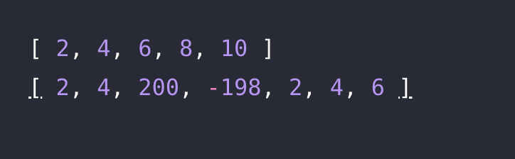

# 🔖  배열 두배 만들기

## `📌 문제`

###### 문제 설명

정수 배열 `numbers`가 매개변수로 주어집니다. `numbers`의 각 원소에 두배한 원소를 가진 배열을 return하도록 solution 함수를 완성해주세요.

------

##### 제한사항

- -10,000 ≤ `numbers`의 원소 ≤ 10,000
- 1 ≤ `numbers`의 길이 ≤ 1,000

------

##### 입출력 예

| numbers                   | result                     |
| ------------------------- | -------------------------- |
| [1, 2, 3, 4, 5]           | [2, 4, 6, 8, 10]           |
| [1, 2, 100, -99, 1, 2, 3] | [2, 4, 200, -198, 2, 4, 6] |

------

##### 입출력 예 설명

입출력 예 #1

- [1, 2, 3, 4, 5]의 각 원소에 두배를 한 배열 [2, 4, 6, 8, 10]을 return합니다.

입출력 예 #2

- [1, 2, 100, -99, 1, 2, 3]의 각 원소에 두배를 한 배열 [2, 4, 200, -198, 2, 4, 6]을 return합니다.


## `✏️ 풀이`

```javascript
function solution(numbers) {
    var answer = [];
  	answer = numbers.map(number => number*2)
    return answer;
}
```

> 배열의 원소를 각각 두배로 만들려면 배열을 우선 모든 요소를 하나씩 가져와 각각에 2를 곱해야한다. 나는 이 방식에서 map 함수를 이용하여 풀었다.
>
> map 함수는 배열 내의 모든 요소 각각에 주어진 함수를 호출한 결과를 모아 새로운 배열을 반환한다.


## `💻 출력 결과`

