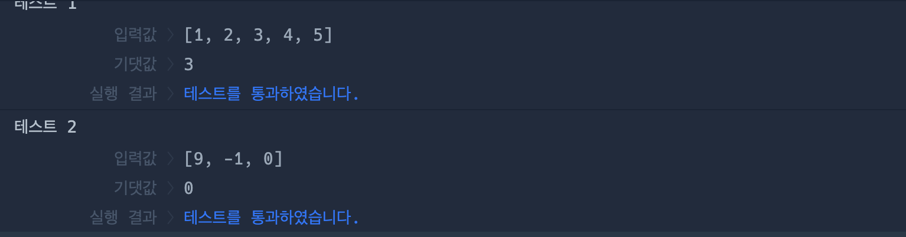

# 🔖  중앙값 구하기

## `📌 문제`

###### 문제 설명

중앙값은 어떤 주어진 값들을 크기의 순서대로 정렬했을 때 가장 중앙에 위치하는 값을 의미합니다. 예를 들어 1, 2, 7, 10, 11의 중앙값은 7입니다. 정수 배열 `array`가 매개변수로 주어질 때, 중앙값을 return 하도록 solution 함수를 완성해보세요.

------

##### 제한사항

- `array`의 길이는 홀수입니다.
- 0 < `array`의 길이 < 100
- -1,000 < `array`의 원소 < 1,000

------

##### 입출력 예

| array             | result |
| ----------------- | ------ |
| [1, 2, 7, 10, 11] | 7      |
| [9, -1, 0]        | 0      |

------

##### 입출력 예 설명

입출력 예 #1

- 본문과 동일합니다.

입출력 예 #2

- 9, -1, 0을 오름차순 정렬하면 -1, 0, 9이고 가장 중앙에 위치하는 값은 0입니다.


## `✏️ 풀이`

```javascript
function solution(array) {
    var answer = 0;
    const ascendingSortArr = array.sort((a, b) => a - b);
    answer = ascendingSortArr[parseInt(ascendingSortArr.length/2)];
    
    return answer;
}
```

> 오름차순으로 정렬하기 위해서 자바스크립트의 sort() 메서드를 사용하였다. 다만, sort 메서드는 유니코드 기반으로 정렬하고, 배열 안에 요소는 문자열로 취급 받기 때문에 숫자로 이루어진 문자는 정렬이 안되는 문제가 있어서 두개의 숫자를 비교하는 함수를 구현하여 인자로 전달를 전달해야 한다.
>
> a-b에서 a가 크면 양수, b가 크면 음수, 같으면 0이 리턴되기 때문에 오름차순으로 구현할 수 있다.
>
> 후에 중앙값을 찾아내기 위해서 length키워드를 통해 배열의 길이를 알아내고 2로 나누어 배열에서 중간을 찾아낸 후, 정수로 변환하여 중간값을 배열의 인덱스에 할당하고 answer에 재할당하여 결과값을 출력하였다.

## `🔍 다른 사람 풀이`

```javascript
// 풀이 1
const solution = array => array.sort((a,b) => a-b)[array.length/2]

// 풀이 2
const solution = (array) => array.sort((a, b) => a - b).at(Math.floor(array.length / 2))
```

> 다른 사람들의 풀이를 찾아 보았다. 
>
> 풀이 1은 나와 풀이과정이 같았지만 정수로 변환하지 않은게 큰 차이였던 것 같다.
>
> 풀이 2에서 at 함수와 Math 를 사용하여 풀었는데 at이 무엇인지 나는 잘 몰라서 찾아보게 되었다.
>
> -  `at()` 메서드는 정수 값을 받아, 배열에서 해당 값에 해당하는 인덱스의 요소를 반환한다. 양수와 음수 모두 지정할 수 있고, 음수 값의 경우 배열의 뒤에서부터 인덱스를 센다.
>   - 예시: `array[array.length - 1]` 을 하는 대신, 짧게 `array.at(-1)`를 사용
>
> - `Math.floor()` 함수는 주어진 숫자와 같거나 작은 정수 중에서 가장 큰 수를 반환한다.

## `💻 출력 결과`

