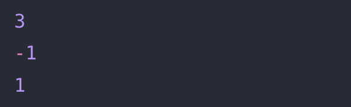

# 🔖  최빈값 구하기

## `📌 문제`

- ###### 문제 설명

  최빈값은 주어진 값 중에서 가장 자주 나오는 값을 의미합니다. 정수 배열 `array`가 매개변수로 주어질 때, 최빈값을 return 하도록 solution 함수를 완성해보세요. 최빈값이 여러 개면 -1을 return 합니다.

  ------

  ##### 제한사항

  - 0 < `array`의 길이 < 100
  - 0 ≤ `array`의 원소 < 1000

  ------

  ##### 입출력 예

  | array              | result |
  | ------------------ | ------ |
  | [1, 2, 3, 3, 3, 4] | 3      |
  | [1, 1, 2, 2]       | -1     |
  | [1]                | 1      |

  ------

  ##### 입출력 예 설명

  입출력 예 #1

  - [1, 2, 3, 3, 3, 4]에서 1은 1개 2는 1개 3은 3개 4는 1개로 최빈값은 3입니다.

  입출력 예 #2

  - [1, 1, 2, 2]에서 1은 2개 2는 2개로 최빈값이 1, 2입니다. 최빈값이 여러 개이므로 -1을 return 합니다.

  입출력 예 #3

  - [1]에는 1만 있으므로 최빈값은 1입니다.


## `✏️ 풀이`

```javascript
function solution(array) {
    var answer = 0;
    let obj = {}
    let arr = []
    
    array.forEach(el => obj[el] = ++obj[el] || 1)
    
    for(let key in obj) {
      arr.push([key, obj[key]])
    }
    
    arr.sort((a, b) => b[1] - a[1]);

    answer = parseInt(arr.length === 1? arr[0][0] : (arr[0][1] === arr[1][1] ? -1 : arr[0][0]));
    
  return answer;
}
```

> 최빈값을 구하기 위해 일반 obj라는 변수에 빈 객체를 선언하고 내림차순으로 정렬하기위해 빈배열 arr 변수를 선언하였다.
>
> 후에 forEach 메서드를 통해 각 배열의 요소들을 키로 지정하고 obj 변수에 값이 없으면 1을 넣어주고, 값이 존재한다면 전위 연산자(`++`)을 사용하여 값에 1을 더해주었다. 이후 for 반복문을 이용하여 obj객체를 빈 배열 arr에 키값 형식으로 넣어주고 sort 메서드를 통하여 내림차순으로 정렬하였다.
>
> 그리고 다중 삼항 연산자를 사용하여 배열의 길이가 1일 때, 첫번째 값을 반환하고 배열의 길이가 1이 아닌 경우, 다시 삼항 연산자를 사용하여 첫번째 값과 두번째의 값이 같을 경우를 비교하여 같다면 -1를 반환, 다르다면 처음값을 반환하고 parseInt 메서드를 통해 문자열을 정수로 변환하였다.

- forEach 메서드
  - 메서드는 주어진 함수를 배열 요소 각각에 대해 실행한다
  - `arr.forEach(callback(currentvalue[, index[, array]])[, thisArg])`

## `🔍 다른 사람 풀이`

```javascript
// 다른 사람 풀이
function solution(array) {
    let map = new Map();
    for (let n of array) map.set(n, (map.get(n) || 0)+1);
    map = [...map].sort((a,b)=>b[1]-a[1]);
    return map.length === 1 || map[0][1] > map[1][1] ? map[0][0] : -1;
}
```

> 나는 forEach 메서드를 사용하고, 빈객체와 빈 배열을 선언하여 사용하였지만, 다른사람은 Map 메서드를 통해 가독성 좋고 더 간단하게 구현한것 같다.
>
> map 객체를 생성하고 for문과 map.set() 키워드를 통해 키를 이용해 값을 저장하였으며 키가 존재하지 않을 경우 undefined가 반환되므로 false 이므로 1를 할당한다. 만약 키가 존재한다면 true이므로 값에 +1를 한다.
>
> 후에 스프레드 문법을 사용하여 새배열은 만든 후 내림차순으로 정렬을 한후 map에 재할당을 한다. 그리고 비교 연산자가 논리 연산자보다 우선이므로, `map[0][1] > map[1][1]` 부터 실행하고 논리연산자를 진행한다. 후에 삼항연산자를 통해 값을 반환한다.

- **`Map()`**
  - 키가 있는 데이터를 저장한다는 점에서 객체와 유사하지만,  map은 키에 다양한 자료형을 허용한다는 점에서 차이가 있다
  - map 주요 메서드
    - `new Map()` – 맵을 만듦
    - `map.set(key, value)` – `key`를 이용해 `value`를 저장
    - `map.get(key)` – `key`에 해당하는 값을 반환합니다. `key`가 존재하지 않으면 `undefined`를 반환
    - `map.has(key)` – `key`가 존재하면 `true`, 존재하지 않으면 `false`를 반환
    - `map.delete(key)` – `key`에 해당하는 값을 삭제
    - `map.clear()` – 맵 안의 모든 요소를 제거
    - `map.size` – 요소의 개수를 반환


## `💻 출력 결과`

