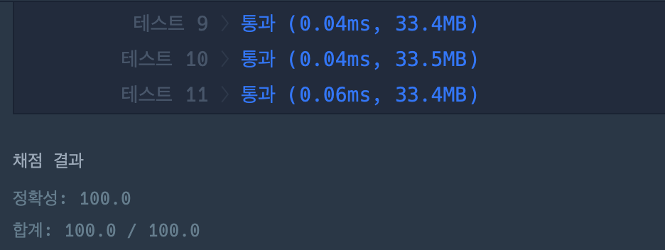

# 🔖  피자 나눠 먹기 (1) 구하기

## `📌 문제`

###### 문제 설명

머쓱이네 피자가게는 피자를 일곱 조각으로 잘라 줍니다. 피자를 나눠먹을 사람의 수 `n`이 주어질 때, 모든 사람이 피자를 한 조각 이상 먹기 위해 필요한 피자의 수를 return 하는 solution 함수를 완성해보세요.

------

##### 제한사항

- 1 ≤ `n` ≤ 100

------

##### 입출력 예

| n    | result |
| ---- | ------ |
| 7    | 1      |
| 1    | 1      |
| 15   | 3      |

------

##### 입출력 예 설명

입출력 예 #1

- 7명이 최소 한 조각씩 먹기 위해서 최소 1판이 필요합니다.

입출력 예 #2

- 1명은 최소 한 조각을 먹기 위해 1판이 필요합니다.

입출력 예 #3

- 15명이 최소 한 조각씩 먹기 위해서 최소 3판이 필요합니다.


## `✏️ 풀이`

```javascript
function solution(n) {
    var answer = 0;
    answer = n % 7 === 0 ? Math.floor(n / 7) : Math.floor(n / 7) + 1;
    return answer;
}
```

> 7명이 최소 한조각씩 먹기 위해서는 피자가 최소 1판이 필요하니 n을 7로 나누었을 때 나머지가 0이 되는 것을 찾으면 된다.
>
> 7의 배수면은 Math.floor를 사용하여 n을 7로 나누어 내림을 해주고, 7의 배수가 아니면 내림해 준값에 1을 더한다 


## `💻 출력 결과`

