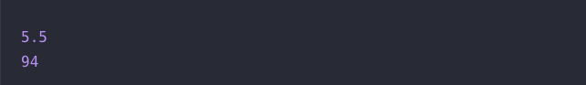

# 🔖  배열의 평균값

## `📌 문제`

- ###### 문제 설명

  정수 배열 `numbers`가 매개변수로 주어집니다. `numbers`의 원소의 평균값을 return하도록 solution 함수를 완성해주세요.

  ------

  ##### 제한사항

  - 0 ≤ `numbers`의 원소 ≤ 1,000
  - 1 ≤ `numbers`의 길이 ≤ 100
  - 정답의 소수 부분이 .0 또는 .5인 경우만 입력으로 주어집니다.

  ------

  ##### 입출력 예

  | numbers                                      | result |
  | -------------------------------------------- | ------ |
  | [1, 2, 3, 4, 5, 6, 7, 8, 9, 10]              | 5.5    |
  | [89, 90, 91, 92, 93, 94, 95, 96, 97, 98, 99] | 94.0   |

  ------

  ##### 입출력 예 설명

  입출력 예 #1

  - `numbers`의 원소들의 평균 값은 5.5입니다.

  입출력 예 #2

  - `numbers`의 원소들의 평균 값은 94.0입니다.


## `✏️ 풀이`

```javascript
function solution(numbers) {
    var answer = 0;
    
    answer = numbers.reduce((num1, num2) => num1 + num2) / numbers.length
  
    return answer;
}
```

> 배열의 요소들의 평균을 구하는 것이므로 배열의 요소들을 전부 더하여 배열의 개수만큼 나누면 평균값이 나온다.
>
> 이중에서 나는 reduce 메서드를 사용하여 풀었다. 

- **`reduce()`** 메서드는 배열의 각 요소에 대해 주어진 리듀서 (reducer) 함수를 실행하고, 하나의 결과값을 반환합니다.
  - `arr.reduce(callback[, initialValue])`
  - 4개의 매개변수(callback)
    - 누산기 (acc)
    - 현재 값 (cur)
    - 현재 인덱스 (idx)
    - 원본 배열 (src)


## `🔍 다른 사람 풀이`

```javascript
// 다른 사람 풀이
function solution(numbers) {
    var answer = 0;

    for (let i = 0; i < numbers.length; i++) {
        answer+= numbers[i];
    }

    return answer / numbers.length;
}
```

> 다른 풀이 방법에서 for 반복문을 사용하여 풀었다.
>
> 배열의 길이까지 i를 1씩 더하고, 배열의 인덱스에 접근하여 answer에 누적하여 연산하였다.


## `💻 출력 결과`

