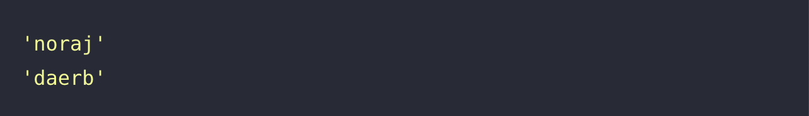

# 🔖 문자열 뒤집기

## `📌 문제`

- ###### 문제 설명

  문자열 `my_string`이 매개변수로 주어집니다. `my_string`을 거꾸로 뒤집은 문자열을 return하도록 solution 함수를 완성해주세요.

  ------

  ##### 제한사항

  - 1 ≤ `my_string`의 길이 ≤ 1,000

  ------

  ##### 입출력 예

  | my_string | return  |
  | --------- | ------- |
  | "jaron"   | "noraj" |
  | "bread"   | "daerb" |

  ------

  ##### 입출력 예 설명

  입출력 예 #1

  - `my_string`이 "jaron"이므로 거꾸로 뒤집은 "noraj"를 return합니다.

  입출력 예 #2

  - `my_string`이 "bread"이므로 거꾸로 뒤집은 "daerb"를 return합니다.


## `✏️ 풀이`

```javascript
function solution(my_string) {
    var answer = '';
    
    answer = my_string.split('').reverse().join('');
    
    return answer;
}
```

> 문자열을 뒤집어서 return하므로 우선 문자열을 split() 메서드를 활용하여 문자열을 나누었다. 그리고 reverse() 메서드로 문자열들을 뒤집고 join()메서드를 통하여 문자열들을 다시 합쳤다.


## `🔍 다른 사람 풀이`

```javascript
// 다른 사람 풀이
function solution(my_string) {
    var answer = [...my_string].reverse().join("");
    return answer;
}
```

> spread 문법을 활용하여 배열을 개별 요소로 복사하여 사용한 기법이다.


## `💻 출력 결과`

