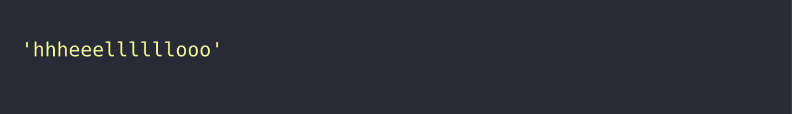

# 🔖 문자열 반복 출력하기

## `📌 문제`

- ###### 문제 설명

  문자열 `my_string`과 정수 `n`이 매개변수로 주어질 때, `my_string`에 들어있는 각 문자를 `n`만큼 반복한 문자열을 return 하도록 solution 함수를 완성해보세요.

  ------

  ##### 제한사항

  - 2 ≤ `my_string` 길이 ≤ 5
  - 2 ≤ `n` ≤ 10
  - "my_string"은 영어 대소문자로 이루어져 있습니다.

  ------

  ##### 입출력 예

  | my_string | n    | result            |
  | --------- | ---- | ----------------- |
  | "hello"   | 3    | "hhheeellllllooo" |

  ------

  ##### 입출력 예 설명

  입출력 예 #1

  - "hello"의 각 문자를 세 번씩 반복한 "hhheeellllllooo"를 return 합니다.


## `✏️ 풀이`

```javascript
function solution(my_string, n) {
    var answer = '';
    
    for (let i = 0; i < my_string.length; i++) {
        answer += my_string[i].repeat(n);
    }
    
    return answer;
}
```

> 입력받은 문자열을 각 문자에 n 개의 개수만큼 반복해서 출력하는 문제이다.
>
> 이 문제를 해결하기 위해 for 반복문을 사용하고, 입력받은 문자열의 길이만큼 반복하였다.
>
> 각 인덱스에 접근하여 요소를 구하고 그것을 repeat() 메서드를 활용하여 반복 출력하고 `+`연산자로 문자를 더하였다.


## `🔍 다른 사람 풀이`

```javascript
// 다른 사람 풀이
function solution(my_string, n) {
    var answer = [...my_string].map(v => v.repeat(n)).join("");
    console.log(answer);
    return answer;
}
```

> 스프레드 기법을 통하여 배열을 깊은 복사를 하고, map() 메서드를 통해 각 요소에 접근하여 repeat로 n번 만큰 반복하고 join 메서드로 다시 각 요소들을 합쳐서 문자열을 만드는 방식을 사용하였다. 


## `💻 출력 결과`

