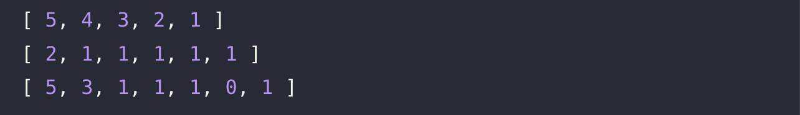

# 🔖 배열 뒤집기

## `📌 문제`

###### 문제 설명

정수가 들어 있는 배열 `num_list`가 매개변수로 주어집니다. `num_list`의 원소의 순서를 거꾸로 뒤집은 배열을 return하도록 solution 함수를 완성해주세요.

------

##### 제한사항

- 1 ≤ `num_list`의 길이 ≤ 1,000
- 0 ≤ `num_list`의 원소 ≤ 1,000

------

##### 입출력 예

| num_list              | result                |
| --------------------- | --------------------- |
| [1, 2, 3, 4, 5]       | [5, 4, 3, 2, 1]       |
| [1, 1, 1, 1, 1, 2]    | [2, 1, 1, 1, 1, 1]    |
| [1, 0, 1, 1, 1, 3, 5] | [5, 3, 1, 1, 1, 0, 1] |

------

##### 입출력 예 설명

입출력 예 #1

- `num_list`가 [1, 2, 3, 4, 5]이므로 순서를 거꾸로 뒤집은 배열 [5, 4, 3, 2, 1]을 return합니다.

입출력 예 #2

- `num_list`가 [1, 1, 1, 1, 1, 2]이므로 순서를 거꾸로 뒤집은 배열 [2, 1, 1, 1, 1, 1]을 return합니다.

입출력 예 #3

- `num_list`가 [1, 0, 1, 1, 1, 3, 5]이므로 순서를 거꾸로 뒤집은 배열 [5, 3, 1, 1, 1, 0, 1]을 return합니다.


## `✏️ 풀이`

```javascript
function solution(num_list) {
    var answer = [];
    
    answer = num_list.reverse();
    
    return answer;
}
```

> 배열을 뒤집어서 반환하는 문제다. arr.reverse() 를 통해 간단히 풀었다.


## `🔍 다른 사람 풀이`

```javascript
// 다른 사람 풀이
function solution(num_list) {
    var answer = [];
    var j = num_list.length
    for(var i = 1; i <= j; i++){
        answer.push(num_list[j-i])
    }
    return answer;
}
```

> j에 매개변수로 입력받은 배열의 길이만큼 저장하여 for 반복문을 통하여 배열의 인덱스로 접근하여 역순으로 푸는 방식이다. 


## `💻 출력 결과`

