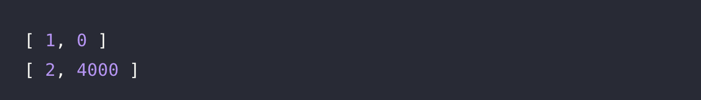

# 🔖 아이스 아메리카노 

## **`📌 문제`**

###### 문제 설명

머쓱이는 추운 날에도 아이스 아메리카노만 마십니다. 아이스 아메리카노는 한잔에 5,500원입니다. 머쓱이가 가지고 있는 돈 `money`가 매개변수로 주어질 때, 머쓱이가 최대로 마실 수 있는 아메리카노의 잔 수와 남는 돈을 순서대로 담은 배열을 return 하도록 solution 함수를 완성해보세요.

------

##### 제한사항

- 0 < `money` ≤ 1,000,000

------

##### 입출력 예

| money  | result    |
| ------ | --------- |
| 5,500  | [1, 0]    |
| 15,000 | [2, 4000] |

------

##### 입출력 예 설명

입출력 예 #1

- 5,500원은 아이스 아메리카노 한 잔을 살 수 있고 잔돈은 0원입니다.

입출력 예 #2

- 15,000원은 아이스 아메리카노 두 잔을 살 수 있고 잔돈은 4,000원입니다.


## **`✏️ 풀이`**

```jsx
function solution(money) {
    var answer = [];
    const americano = 5_500;
    let count = 0;
    let change = money;
    
    while ( change >= americano ) {
        change -= americano;
        count++;
    }
  
    answer.push(count, change)
    
    return answer;
}
```

> 아메리카노 한잔에 5,500원이므로 변수 americano에 5500을 할당하여 사용하였다. 그리고 아메리카노를 구입 가능한 횟수를 저장할 변수 count에 0으로 초기화 하였고, 매개변수 money를 change 변수에 할당하여 잔액을 알 수 있도록 하였다.
>
> 이 문제는 조건이 있고, 입력한 금액에서 아메리카노를 최대한 구매해야하므로 while 반복문을 사용하였다. 잔액이 아메리카노 가격보다 같거나 커야하며, 조건에 맞으면 잔액에서 아메리카노를 차감하고 할당한다. 그리고 횟수 1을 증가시키고 조건에 맞을때까지 반복한다.
>
> 그런 다음 push를 사용하여 answer 변수에 구매 가능 횟수와, 잔액을 배열로 추가하였다.


## **`🔍 다른 사람 풀이`**

```jsx
function solution(money) {
    return [Math.floor(money / 5500), money % 5500];
}
```

> 다른 사람 풀이에서는 Math.floor() 메서드를 사용하여 소수점 아래를 버리면서 내림을 하고, money를 아메리카노 금액인 5500으로 나누어 횟수글 계산 하였다. 잔액은 나머지 연산을 활용하여 푼것 같다.
>
> 이렇게 푸는 것이 가독성도 좋을 뿐더러 코드도 간결해져서 보기 좋았던 것 같았다.


## **`💻 출력 결과`**

