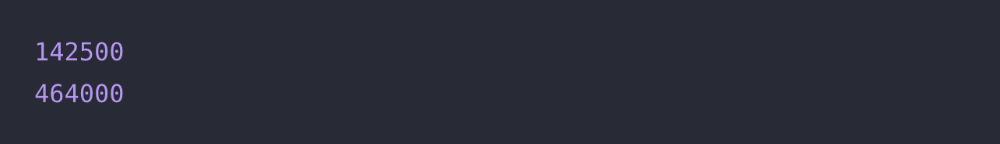

# 🔖  옷가게 할인 받기

## `📌 문제`

머쓱이네 옷가게는 10만 원 이상 사면 5%, 30만 원 이상 사면 10%, 50만 원 이상 사면 20%를 할인해줍니다.
구매한 옷의 가격 `price`가 주어질 때, 지불해야 할 금액을 return 하도록 solution 함수를 완성해보세요.

------

##### 제한사항

- 10 ≤ price ≤ 1,000,000
  - `price`는 10원 단위로(1의 자리가 0) 주어집니다.
- 소수점 이하를 버린 정수를 return합니다.

------

##### 입출력 예

| price   | result  |
| ------- | ------- |
| 150,000 | 142,500 |
| 580,000 | 464,000 |

------

##### 입출력 예 설명

입출력 예 #1

- 150,000원에서 5%를 할인한 142,500원을 return 합니다.

입출력 예 #2

- 580,000원에서 20%를 할인한 464,000원을 return 합니다.


## `✏️ 풀이`

```javascript
function solution(price) {
    var answer = 0;
    
    if(price >= 100_000 && price < 300_000)
        answer = Math.floor(price * 0.95);
    else if(price >= 300_000 && price < 500_000)
        answer = Math.floor(price * 0.9);
    else if(price >= 500_000)
        answer = Math.floor(price * 0.8);
    else
        answer = Math.floor(price);
    
    return answer;
}
```

> 10만원 이상 사면 5% 할인, 30만원 이상 사면 10% 할인, 50만원 이상 사면 20% 할인 받으므로 조건식 if문을 생각하였다. 후에 가격을 쉽게 알아보기 위해 `_` 를 사용하여 구분하였다. 조건에 소수점 이하를 버린 정수를 return하므로 Math.floor를 사용하였다. 


## `🔍 다른 사람 풀이`

```javascript
// 다른 사람 풀이
function solution(price) {
  price = price >= 500000 ? price * 0.8 : ( price >= 300000 ? price * 0.9 : (price >= 100000 ? price * 0.95 : price));
    
  return ~~(price);
}
```

> 다른 풀이 방법에서는 삼항 연산자를 이용하여 풀었다. 코드의 줄이 훨씬 줄어 보이는 장점이 있어 보였다. 마지막에 `~~`가 무슨 의미인지 몰라서 찾아 보게 되었는데 틸드 연산자를 두번 사용한 더블틸드 연산자라고 한다. Math.floor() 메서드와 같은 기능을 한다.

- **tilde(`~`) 연산자**

  - Bitwise 연산자로 NOT의 기능을 한다

  - 0과 1을 뒤집는다 (ex: `-(n+1)`)

  - ```javascript
    const num1 = 5;     // 0000000000000101
    console.log(~num1); // 1111111111111010
    // expected output: -6
    ```

- **double tilde(`~~`) 연산자**

  - tilde 연산자를 두번 사용한 것이다

  - `Math.floor()` 역할과 비슷하지만 음수에서 차이가 있다

  - ```javascript
    const num1 = 123.1;
    const num2 = -1.1;
    
    console.log(Math.floor(num1));	// 123
    console.log(~~num1);	// 123
    
    console.log(Math.floor(num2));  // -2
    console.log(~~num2);	// -1
    ```

    

## `💻 출력 결과`

