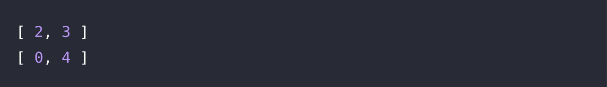

# 🔖 짝수 홀수 개수

## `📌 문제`

###### 문제 설명

정수가 담긴 리스트 `num_list`가 주어질 때, `num_list`의 원소 중 짝수와 홀수의 개수를 담은 배열을 return 하도록 solution 함수를 완성해보세요.

------

##### 제한사항

- 1 ≤ `num_list`의 길이 ≤ 100
- 0 ≤ `num_list`의 원소 ≤ 1,000

------

##### 입출력 예

| num_list        | result |
| --------------- | ------ |
| [1, 2, 3, 4, 5] | [2, 3] |
| [1, 3, 5, 7]    | [0, 4] |

------

##### 입출력 예 설명

입출력 예 #1

- [1, 2, 3, 4, 5]에는 짝수가 2, 4로 두 개, 홀수가 1, 3, 5로 세 개 있습니다.

입출력 예 #2

- [1, 3, 5, 7]에는 짝수가 없고 홀수가 네 개 있습니다.


## `✏️ 풀이`

```javascript
function solution(num_list) {
    var answer = [];
    let evenNumberCount = 0;
    let oddNumberCount = 0;
    
    for(let i = 0; i < num_list.length; i++) {
        if(num_list[i] % 2 === 0) evenNumberCount++;
        else if(num_list[i] % 2 === 1) oddNumberCount++;
    }
    answer.push(evenNumberCount, oddNumberCount);
    
    return answer;
}
```

> 짝수와 홀수는 숫자를 2로 나누면 나머지가 0이면 짝수, 나머지가 1이면 홀수이므로 나머지 연산을 통해 구하면 된다. 
>
> 입력 받은 요소에 접근해야하므로 for 반복문을 사용하여 인덱스로 접근하였다. 짝수의 개수를 구하기 위하여  evenNumberCount변수를 선언하여 0으로 초기화를 하고, 홀수의 개수를 구하기 위해 oddNumberCount변수를 0으로 초기화 하였다.
>
> 그리고 입력받은 배열의 길이만큼 반복하고, 만약 배열의 요소가 2로 나누어져 나머지가 0이면 evenNumberCount를 1을 더했고, 나머지가 1이면 oddNumberCount에 1을 더하여 개수를 구하고 반복하였다. 반환값에는 answer배열에 push를 사용하여 짝수와 홀수를 추가하였다. 


## `🔍 다른 사람 풀이`

```javascript
// 다른 사람 풀이
function solution(num_list) {
    var answer = [0,0];

    for(let a of num_list){
        answer[a%2] += 1
    }

    return answer;
}
```

> for...of 명령문을 사용하여 푸는 방식이다. 배열 `[1, 2, 3, 4, 5]`를 입력받는다고 했을 때, 1%2는 0이므로 answer[0]에 1을 할당,
>
> 2%2는 1이므로 answer[1]에 1을 할당, 3%2는 0이므로 answer[0]에 누적된 값에 1 더하는 방식이다. 이렇게 풀면 if 조건문을 실행할 필요도 없이 바로 저장이 되고, 메모리 공간도 아낄 수 있는 장점이 있는 것 같다. 

- **for...of**

  - 반복 가능한 객체에 대해서 반복하고 각 개별 속성값에 대해 실행되는 문이 있는 사용자 정의 반복 후크를 호출하는 루프를 생성

  - `for (variable of iterable) {  statement }`

  - ```javascript
    const array1 = ['a', 'b', 'c'];
    
    for (const element of array1) {
      console.log(element);
    }
    
    // expected output: "a"
    // expected output: "b"
    // expected output: "c"
    ```

    


## `💻 출력 결과`

