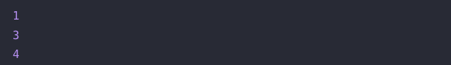

# 🔖 각도기

## `📌 문제`

###### 문제 설명

각에서 0도 초과 90도 미만은 예각, 90도는 직각, 90도 초과 180도 미만은 둔각 180도는 평각으로 분류합니다. 각 `angle`이 매개변수로 주어질 때 예각일 때 1, 직각일 때 2, 둔각일 때 3, 평각일 때 4를 return하도록 solution 함수를 완성해주세요.

- 예각 : 0 < `angle` < 90
- 직각 : `angle` = 90
- 둔각 : 90 < `angle` < 180
- 평각 : `angle` = 180

------

##### 제한사항

- 0 < `angle` ≤ 180
- `angle`은 정수입니다.

------

##### 입출력 예

| angle | result |
| ----- | ------ |
| 70    | 1      |
| 91    | 3      |
| 180   | 4      |

------

##### 입출력 예 설명

입출력 예 #1

- `angle`이 70이므로 예각입니다. 따라서 1을 return합니다.

입출력 예 #2

- `angle`이 91이므로 둔각입니다. 따라서 3을 return합니다.

입출력 예 #2

- `angle`이 180이므로 평각입니다. 따라서 4를 return합니다.


## `✏️ 풀이`

```javascript
function solution(angle) {
    var answer = 0;
    if(angle>0 && angle<90)
        answer = 1;
    else if(angle === 90)
        answer = 2;
    else if(angle>90 && angle<180)
        answer = 3;
    else if(angle === 180)
        answer = 4;
    return answer;
}
```

> 예각, 직각, 둔각, 평각은 조건이 있으므로 if 조건문을 활용하여 풀게되었다. 조건에 따라 값을 출력한다. 한줄은 {}와 return을 생략할 수 있다.


## `🔍 다른 사람 풀이`

```javascript
// 다른 사람 풀이
function solution(angle) {
    return [0, 90, 91, 180].filter(x => angle>=x).length;
}
```

> 다른사람 풀이에서는 각도별로 저장해놓은 배열을 만들어 filter()메서드를 활용하여 문제를 풀었다. 반환값 같은 경우는 배열의 길이를 지정하여 반환하였다. 같은 문제에서 이런 코드를 구상할 수 있다는게 창의력이 높다고 생각하였다.

- **filter()**
  - 주어진 함수의 테스트를 통과하는 모든 요소를 모아 새로운 배열로 반환
  - `arr.filter(callback(element[, index[, array]])[, thisArg])`

## `💻 출력 결과`

