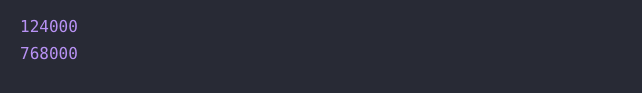

# 🔖 양꼬치

## `📌 문제`

###### 문제 설명

머쓱이네 양꼬치 가게는 10인분을 먹으면 음료수 하나를 서비스로 줍니다. 양꼬치는 1인분에 12,000원, 음료수는 2,000원입니다. 정수 `n`과 `k`가 매개변수로 주어졌을 때, 양꼬치 `n`인분과 음료수 `k`개를 먹었다면 총얼마를 지불해야 하는지 return 하도록 solution 함수를 완성해보세요.

------

##### 제한사항

- 0 < `n` < 1,000
- n / 10 ≤ `k` < 1,000
- 서비스로 받은 음료수는 모두 마십니다.

------

##### 입출력 예

| n    | k    | result  |
| ---- | ---- | ------- |
| 10   | 3    | 124,000 |
| 64   | 6    | 768,000 |

------

##### 입출력 예 설명

입출력 예 #1

- 10인분을 시켜 서비스로 음료수를 하나 받아 총 10 * 12000 + 3 * 2000 - 1 * 2000 = 124,000원입니다.

입출력 예 #2

- 64인분을 시켜 서비스로 음료수를 6개 받아 총 64 * 12000 + 6 * 2000 - 6 * 2000 =768,000원입니다.


## `✏️ 풀이`

```javascript
function solution(n, k) {
    var answer = 0;
    const lambSkewers = 12_000;
    const drink = 2_000;
    
    answer = n * lambSkewers + k * drink - (Math.floor(n / 10)) * drink;
    
    return answer;
}
```

> 양꼬치가 12,000원, 음료수가 2,000원이므로 변수를 각각 선언해 주었다. 양꼬치 10인분당 음료수 1개가 서비스로 나가므로, 
>
> 양꼬치 개수 *양꼬치 가격 + 음료수 개수 * 음료수 가격 - 서비스 음료수 개수 * 음료수 가격 이된다.
>
> 서비스 음료수는 양꼬치 10인분당 1개이므로 n/10으로 지정하고 소수점아래는 버림처리 하였다.   


## `🔍 다른 사람 풀이`

```javascript
// 다른 사람 풀이
function solution(n, k) {
    k-=~~(n/10);
    if (k < 0) k = 0;
    return n*12000+k*2000;
}
```

> double tilde를 활용하여 문제를 푼것이다. 
>
> 매개변수 k에 서비스 음료수를 계산하고 `~~`를 사용하여 math.floor() 메서드랑 같은 효과를 내었다. 후에 서비스 음료수가 -가 되면, k = 0으로 할당하여 문제를 해결하였다.


## `💻 출력 결과`

