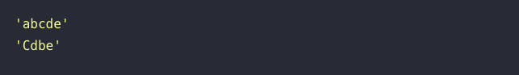

# 🔖 특정 문자 제거하기

## `📌 문제`

##### 입출력 예

| my_string | letter | result  |
| --------- | ------ | ------- |
| "abcdef"  | "f"    | "abcde" |
| "BCBdbe"  | "B"    | "Cdbe"  |

------

##### 입출력 예 설명

입출력 예 #1

- "abcdef" 에서 "f"를 제거한 "abcde"를 return합니다.

입출력 예 #2

- "BCBdbe" 에서 "B"를 모두 제거한 "Cdbe"를 return합니다.


## `✏️ 풀이`

```javascript
function solution(my_string, letter) {
    var answer = '';
    let regexAllCase = new RegExp(letter,"g");
  
    answer = my_string.replace(regexAllCase, '');
    
    return answer;
}
```

> 특정 문자를 제거하기위해 replace() 메서드를 우선 생각하였다. 특정 문자를 모두 사용해야하기 때문에 정규식을 사용하여 매개변수 letter를 정규 표현식으로 만들어 문제를 해결하였다.

- **replace()**

  - 어떤 패턴에 일치하는 일부 또는 모든 부분이 교체된 새로운 문자열을 반환
  - `var newStr = str.replace(regexp|substr, newSubstr|function)`

- **정규 표현식**

  - 문자열에서 특정 문자 조합을 찾기 위한 패턴

  - 정규 표현식 생성

    - 정규 표현식 리터럴: `const re = /ab+c/`
    - RegExp 객체의 생성자 호출: `const re = new RegExp('ab+c')`

  - 플래그를 활용한 고급 탐색

    정규 표현식은 전역 탐색이나 대소문자 무시와 같은 특성을 지정하는 플래그를 가질 수 있습니다. 플래그는 단독으로 사용할 수도 있고, 순서에 상관 없이 한꺼번에 여럿을 지정할 수도 있습니다.

    | 플래그 | 설명                                                         | 대응하는 속성                                                |
    | :----- | :----------------------------------------------------------- | :----------------------------------------------------------- |
    | `d`    | 부분 문자열 일치에 대해 인덱스 생성.                         | [`RegExp.prototype.hasIndices` (en-US)](https://developer.mozilla.org/en-US/docs/Web/JavaScript/Reference/Global_Objects/RegExp/hasIndices) |
    | `g`    | 전역 탐색.                                                   | [`RegExp.prototype.global` (en-US)](https://developer.mozilla.org/en-US/docs/Web/JavaScript/Reference/Global_Objects/RegExp/global) |
    | `i`    | 대소문자를 구분하지 않음.                                    | [`RegExp.prototype.ignoreCase` (en-US)](https://developer.mozilla.org/en-US/docs/Web/JavaScript/Reference/Global_Objects/RegExp/ignoreCase) |
    | `m`    | 여러 줄에 걸쳐 탐색.                                         | [`RegExp.prototype.multiline` (en-US)](https://developer.mozilla.org/en-US/docs/Web/JavaScript/Reference/Global_Objects/RegExp/multiline) |
    | `s`    | 개행 문자가 `.`과 일치함.                                    | [`RegExp.prototype.dotAll`](https://developer.mozilla.org/ko/docs/Web/JavaScript/Reference/Global_Objects/RegExp/dotAll) |
    | `u`    | "unicode", 패턴을 유니코드 코드 포인트의 시퀀스로 간주함.    | [`RegExp.prototype.unicode` (en-US)](https://developer.mozilla.org/en-US/docs/Web/JavaScript/Reference/Global_Objects/RegExp/unicode) |
    | `y`    | "접착" 탐색, 대상 문자열의 현재 위치에서 탐색을 시작함. [`sticky` (en-US)](https://developer.mozilla.org/en-US/docs/Web/JavaScript/Reference/Global_Objects/RegExp/sticky)를 참고하세요. | [`RegExp.prototype.sticky` (en-US)](https://developer.mozilla.org/en-US/docs/Web/JavaScript/Reference/Global_Objects/RegExp/sticky) |


[MDN 정규 표현식](https://developer.mozilla.org/ko/docs/Web/JavaScript/Guide/Regular_Expressions)

## `🔍 다른 사람 풀이`

```javascript
// 다른 사람 풀이
function solution(my_string, letter) {
    const answer = my_string.split(letter).join('')
    return answer;
}
```

> 이 풀이에서는 replace() 메서드를 이용하지 않고, split()메서드를 활용하여 문자열을  매개변수 letter로 나누고 다시 join()메서드를 활용하여 문자들을 합쳐 반환하는 방식을 사용하였다. 


## `💻 출력 결과`

