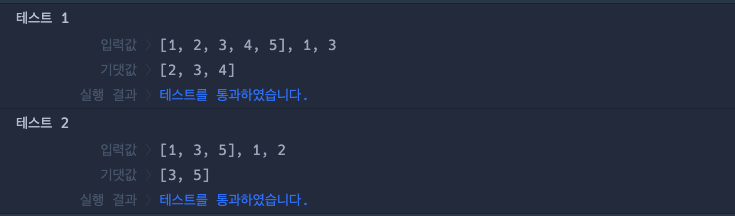

# 🔖 배열 자르기

## `📌 문제`

###### 문제 설명

정수 배열 `numbers`와 정수 `num1`, `num2`가 매개변수로 주어질 때, `numbers`의 `num1`번 째 인덱스부터 `num2`번째 인덱스까지 자른 정수 배열을 return 하도록 solution 함수를 완성해보세요.

------

##### 제한사항

- 2 ≤ `numbers`의 길이 ≤ 30
- 0 ≤ `numbers`의 원소 ≤ 1,000
- 0 ≤`num1` < `num2` < `numbers`의 길이

------

##### 입출력 예

| numbers         | num1 | num2 | result    |
| --------------- | ---- | ---- | --------- |
| [1, 2, 3, 4, 5] | 1    | 3    | [2, 3, 4] |
| [1, 3, 5]       | 1    | 2    | [3, 5]    |

------

##### 입출력 예 설명

입출력 예 #1

- [1, 2, 3, 4, 5]의 1번째 인덱스 2부터 3번째 인덱스 4 까지 자른 [2, 3, 4]를 return 합니다.

입출력 예 #2

- [1, 3, 5]의 1번째 인덱스 3부터 2번째 인덱스 5까지 자른 [3, 5]를 return 합니다.


## `✏️ 풀이`

```javascript
function solution(numbers, num1, num2) {
    var answer = [];
    
    answer = numbers.slice(num1, num2 + 1);
    
    return answer;
}
```

> 배열을 입력받은 num1부터 num2까지 자르므로 slice() 메서드를 생각하였다.
>
> slice() 메서드의 두번째 인자는 받은 인자-1 만큼 출력을 하므로 +1을 하였다.


## `🔍 다른 사람 풀이`

```javascript
// 다른 사람 풀이
function solution(numbers, num1, num2) {
    var answer = [];

    for (let i = num1; i < num2+1; i++) {
        answer.push(numbers[i])
    }

    return answer;
}
```

> for 반복문을 이용하여 푼 방식이다. i 변수에 num1을 할당하고 num2+1보다 작을때까지 반복한다. 후에 numbers의 요소를 answer배열에 추가한다.


## `💻 출력 결과`

