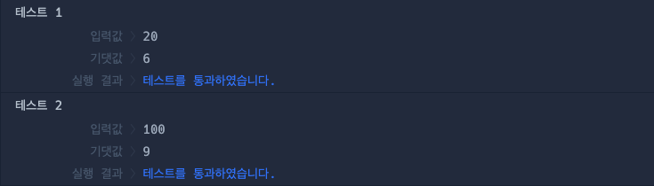

# 🔖 순서쌍의 개수

## `📌 문제`

###### 문제 설명

순서쌍이란 두 개의 숫자를 순서를 정하여 짝지어 나타낸 쌍으로 (a, b)로 표기합니다. 자연수 `n`이 매개변수로 주어질 때 두 숫자의 곱이 `n`인 자연수 순서쌍의 개수를 return하도록 solution 함수를 완성해주세요.

------

##### 제한사항

- 1 ≤ n ≤ 1,000,000

------

##### 입출력 예

| n    | result |
| ---- | ------ |
| 20   | 6      |
| 100  | 9      |

------

##### 입출력 예 설명

입출력 예 #1

- `n`이 20 이므로 곱이 20인 순서쌍은 (1, 20), (2, 10), (4, 5), (5, 4), (10, 2), (20, 1) 이므로 6을 return합니다.

입출력 예 #2

- `n`이 100 이므로 곱이 100인 순서쌍은 (1, 100), (2, 50), (4, 25), (5, 20), (10, 10), (20, 5), (25, 4), (50, 2), (100, 1) 이므로 9를 return합니다.


## `✏️ 풀이`

```javascript
function solution(n) {
    var answer = 0;
    
    for (let i = 0; i <= n; i++) {
        if(n % i === 0)
            answer += 1;
    }
    
    return answer;
}
```

> 순서쌍은 약수를 구하는 것이므로 for문을 이용하여 약수를 구하고 매개변수 n까지 반복문을 반복하되 n이 i로 나누었을때 나머지가 0이면 answer에 1을 더하도록 하여 개수를 구하였다.


## `🔍 다른 사람 풀이`

```javascript
// 다른 사람 풀이
function solution(n) {
      return Array(n).fill(1).map((v,idx) => v + idx).filter(v => n % v === 0).length
}
```

> 이 풀이에서는 for문으로 구하지 않고 Array()메서드를 통해 매개변수 n개만큼 배열로 만들고 fill()메서드로 시작부터 끝까지 1로 채웠다. 후에 map()메서드를 이용하여 요소(v)와 index(idx)를 더하여 1부터 n까지 배열을 채웠다. 후에 fillter 메서드를 통해 n이 요소로 나누었을때 나머지가 0인것만 반환하고 length로 배열의 길이를 구해 개수를 구하였다.


## `💻 출력 결과`

