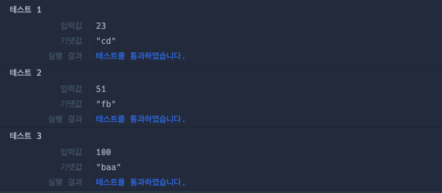

# 🔖 외계행성 나이

## `📌 문제`

###### 문제 설명

우주여행을 하던 머쓱이는 엔진 고장으로 PROGRAMMERS-962 행성에 불시착하게 됐습니다. 입국심사에서 나이를 말해야 하는데, PROGRAMMERS-962 행성에서는 나이를 알파벳으로 말하고 있습니다. a는 0, b는 1, c는 2, ..., j는 9입니다. 예를 들어 23살은 cd, 51살은 fb로 표현합니다. 나이 `age`가 매개변수로 주어질 때 PROGRAMMER-962식 나이를 return하도록 solution 함수를 완성해주세요.

------

##### 제한사항

- `age`는 자연수입니다.
- `age` ≤ 1,000
- PROGRAMMERS-962 행성은 알파벳 소문자만 사용합니다.

------

##### 입출력 예

| age  | result |
| ---- | ------ |
| 23   | "cd"   |
| 51   | "fb"   |
| 100  | "baa"  |

------

##### 입출력 예 설명

입출력 예 #1

- `age`가 23이므로 "cd"를 return합니다.

입출력 예 #2

- `age`가 51이므로 "fb"를 return합니다.

입출력 예 #3

- `age`가 100이므로 "baa"를 return합니다.


## `✏️ 풀이`

```javascript
function solution(age) {
    var answer = '';
    const ageObject = {
        "0": "a",
        "1": "b",
        "2": "c",
        "3": "d",
        "4": "e",
        "5": "f",
        "6": "g",
        "7": "h",
        "8": "i",
        "9": "j"
    };
    
    answer = String(age).split('').map(el => ageObject[el]).join('');
    
    return answer;
}
```

> 나이를 외계행성 나이로 바꾸는 문제다. 외계행성 나이는 고정이므로 const 객체를 사용하면 될것 같다는 생각으로 풀었다.
>
> 키를 나이 숫자로 지정하고, 값을 외계행성 나이로 지정하였다.
>
> 입력받은 값을 문자열로 변환하고 split()메서드를 활용하여 연속되지 않게 하였다. 그다음 map() 메서드를 사용하여 key값을 입력받고 외계행성 나이를 반환하고 다시 join 메서드로 합치었다.


## `🔍 다른 사람 풀이`

```javascript
// 다른 사람 풀이
function solution(age) {
    let char = 'abcdefghij'
    return Array.from(age.toString()).map(t => char[+t]).join('');
}
```

> 외계행성 나이를 하나의 변수에 할당하고, Array.from 을 활용하여 문제를 푼 방식이다. Array.from() 을 활용하여 얇은 복사를 하고, age를 문자열로 변환하여 map() 메서드를 활용하였다. 인덱스로 접근하여 더하는 방식으로 활용하였다.


## `💻 출력 결과`

