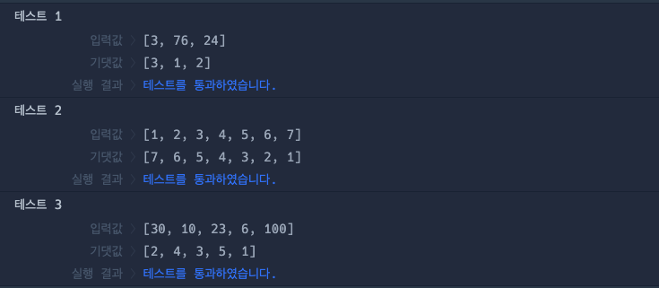

# 🔖 진료 순서 정하기

## `📌 문제`

###### 문제 설명

외과의사 머쓱이는 응급실에 온 환자의 응급도를 기준으로 진료 순서를 정하려고 합니다. 정수 배열 `emergency`가 매개변수로 주어질 때 응급도가 높은 순서대로 진료 순서를 정한 배열을 return하도록 solution 함수를 완성해주세요.

------

##### 제한사항

- 중복된 원소는 없습니다.
- 1 ≤ `emergency`의 길이 ≤ 10
- 1 ≤ `emergency`의 원소 ≤ 100

------

##### 입출력 예

| emergency             | result                |
| --------------------- | --------------------- |
| [3, 76, 24]           | [3, 1, 2]             |
| [1, 2, 3, 4, 5, 6, 7] | [7, 6, 5, 4, 3, 2, 1] |
| [30, 10, 23, 6, 100]  | [2, 4, 3, 5, 1]       |

------

##### 입출력 예 설명

입출력 예 #1

- `emergency`가 [3, 76, 24]이므로 응급도의 크기 순서대로 번호를 매긴 [3, 1, 2]를 return합니다.

입출력 예 #2

- `emergency`가 [1, 2, 3, 4, 5, 6, 7]이므로 응급도의 크기 순서대로 번호를 매긴 [7, 6, 5, 4, 3, 2, 1]를 return합니다.

입출력 예 #3

- `emergency`가 [30, 10, 23, 6, 100]이므로 응급도의 크기 순서대로 번호를 매긴 [2, 4, 3, 5, 1]를 return합니다.


## `✏️ 풀이`

```javascript
function solution(emergency) {
    var answer = [];
    let emergencyOrder = [...emergency].sort((a, b) => b - a);
    let order = 0;
    
    for (let i = 0; i< emergencyOrder.length; i++) {
        for (let j = 0; j < emergencyOrder.length; j++) {
            if (emergency[j] === emergencyOrder[i])
               answer[j] = ++order;
        }
    }
    
    return answer;
}
```

> 응급도에 따른 진료 순서를 구하는 문제이다. 
>
> 일단 순서를 정하려고 내림차순으로 정렬한 배열을 깊은 복사하여 할당하였다. 후에 순서를 나타내는 변수 order를 0으로 초기화한다.
>
> 그다음 인덱스를 하나씩 비교하기 위해 이중for문을 구현하였다. 매개변수를 복사하여 내림차순으로 정렬한 배열의 길이 만큼 반복하고, emergencyOrder[i]가 emergency[j]와 같으면 answer 배열의 인덱스 j 에 선위연산자 ++하여 숫자를 매겨 우선순위를 정하고 이 과정을 반복한다.
>


## `🔍 다른 내 풀이 / 다른 사람 풀이`

```javascript
// 다른 내 풀이
function solution(emergency) {
    var answer = [];
    let emergencyOrder = [...emergency].sort((a, b) => b - a);
    
    for (let i of emergency)
        answer.push(emergencyOrder.indexOf(i) + 1);
    
    return answer;
}

// 다른 사람 풀이
function solution(emergency) {
    let sorted = emergency.slice().sort((a,b)=>b-a);
    return emergency.map(v=>sorted.indexOf(v)+1);
}
```

> ##### 다른 내 풀이
>
> 이중 for문 말고 다른 풀이 없을까 하고 찾아보다가 for...of 로 푸는 방식으로 다시 풀어 보았다. 
>
> 위 풀이 과정처럼 배열을 깊은 복사를 하고 내림차순으로 정렬한다.
>
> 그다음 for...of문을 이용하여 배열을 순회하면서  indexOf() 메서드를 활용하여 요소를 찾아 인덱스를 반환하고 +1을 해준다.
>
> 처음 풀이보다 이 과정으로 푸는게 가독성이 더 좋은것 같았다.

> ##### 다른 사람 풀이 
>
> 이 풀이에서 slice() 메서드를 활용하여 문자열들을 자르고, 내림차순으로 정렬하였다.
>
> 리턴 값으로 map()메서드를 활용하여 각 요소들을 순회하면서 indexOf()메서드를 사용해 배열의 요소를 찾아 인덱스를 반환하고 +1을 해주었다.
>
> 코드가 확실히 줄어든게 눈으로 보이고 깔끔하게 보였다.


## `💻 출력 결과`

