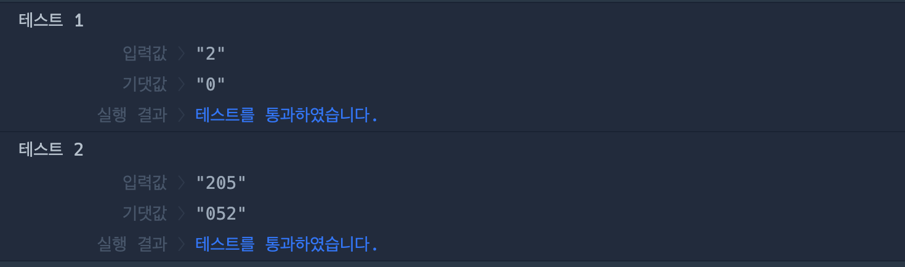

# 🔖 가위 바위 보

## `📌 문제`

###### 문제 설명

가위는 2 바위는 0 보는 5로 표현합니다. 가위 바위 보를 내는 순서대로 나타낸 문자열 `rsp`가 매개변수로 주어질 때, rsp에 저장된 가위 바위 보를 모두 이기는 경우를 순서대로 나타낸 문자열을 return하도록 solution 함수를 완성해보세요.

------

##### 제한사항

- 0 < `rsp`의 길이 ≤ 100
- `rsp`와 길이가 같은 문자열을 return 합니다.
- `rsp`는 숫자 0, 2, 5로 이루어져 있습니다.

------

##### 입출력 예

| rsp   | result |
| ----- | ------ |
| "2"   | "0"    |
| "205" | "052"  |

------

##### 입출력 예 설명

입출력 예 #1

- "2"는 가위이므로 바위를 나타내는 "0"을 return 합니다.

입출력 예 #2

- "205"는 순서대로 가위, 바위, 보이고 이를 모두 이기려면 바위, 보, 가위를 순서대로 내야하므로 “052”를 return합니다.


## `✏️ 풀이`

```javascript
function solution(rsp) {
    var answer = '';
    const rockPaperScissors = {
        "2": "0",
        "0": "5",
        "5": "2"
    };
    
    answer = rsp.split('').map(v => rockPaperScissors[v]).join('');
    
    return answer;
}
```

> 가위 바위 보를 이기는 수를 정하기 위해 객체로 만들어 푸는 방식으로 접근하였다.
>
> 내는 경우를 키로 지정하고 이기는 경우를 값으로 지정하였다.
>
> split()메서드를 사용하여 매개변수 rsp를 나누고, map을 사용하여 배열을 순회하여 객체의 키에 집어넣어 값을 반환하고 join()메서드로 다시 합쳐주었다.


## `🔍 다른 사람 풀이`

```javascript
// 다른 사람 풀이
function solution(rsp) {
    return rsp.split("").map((v) => v==="2" ? 0 : (v==="0" ? 5 : 2)).join("")
}
```

> 삼항연잔자를 이용하여 푼 방식이다.


## `💻 출력 결과`

