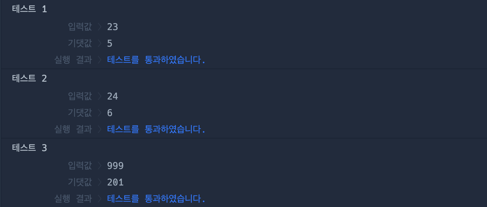

# 🔖 개미 군단

## `📌 문제`

###### 문제 설명

개미 군단이 사냥을 나가려고 합니다. 개미군단은 사냥감의 체력에 딱 맞는 병력을 데리고 나가려고 합니다. 장군개미는 5의 공격력을, 병정개미는 3의 공격력을 일개미는 1의 공격력을 가지고 있습니다. 예를 들어 체력 23의 여치를 사냥하려고 할 때, 일개미 23마리를 데리고 가도 되지만, 장군개미 네 마리와 병정개미 한 마리를 데리고 간다면 더 적은 병력으로 사냥할 수 있습니다. 사냥감의 체력 `hp`가 매개변수로 주어질 때, 사냥감의 체력에 딱 맞게 최소한의 병력을 구성하려면 몇 마리의 개미가 필요한지를 return하도록 solution 함수를 완성해주세요.

------

##### 제한사항

- `hp`는 자연수입니다.
- 0 ≤ `hp` ≤ 1000

------

##### 입출력 예

| hp   | result |
| ---- | ------ |
| 23   | 5      |
| 24   | 6      |
| 999  | 201    |

------

##### 입출력 예 설명

입출력 예 #1

- `hp`가 23이므로, 장군개미 네마리와 병정개미 한마리로 사냥할 수 있습니다. 따라서 5를 return합니다.

입출력 예 #2

- `hp`가 24이므로, 장군개미 네마리 병정개미 한마리 일개미 한마리로 사냥할 수 있습니다. 따라서 6을 return합니다.

입출력 예 #3

- `hp`가 999이므로, 장군개미 199 마리 병정개미 한마리 일개미 한마리로 사냥할 수 있습니다. 따라서 201을 return합니다.


## `✏️ 풀이`

```javascript
function solution(hp) {
    var answer = 0;
    const antArmy = { 
      generalAnt: "5",   
      soldierAnt: "3",
      ergate: "1"
    };
    
    for(const v in antArmy) {
        answer += parseInt(hp / antArmy[v])
        hp %= antArmy[v]
    }
  
    return answer;
}
```

> 장군 개미의 공격력 5, 병장 개미의 공격력이 3, 일개미의 공격력이 1로 주어졌으므로, 이 공격력은 변하지 않는다. 따라서 나는 const를 사용하여  객체를 만들었다. 그 다음 객체를 순회하는 for...in 반복문을 통하여 몫과 나머지를 구하고 이것을 반복하였다.


## `🔍 다른 사람 풀이`

```javascript
// 다른 사람 풀이
function solution(hp) {
    const 장군개미 = Math.floor(hp / 5);
    const 병정개미 = Math.floor((hp - (장군개미 * 5)) / 3);
    const 일개미 = hp - ((장군개미 * 5) + (병정개미 * 3));
    return 장군개미+병정개미+일개미;
}
```

> 이 풀이에서는 장군개미와 병정개미, 일개미를 각각 구하고 변수로 저장하여 return값으로 반환해주었다.


## `💻 출력 결과`

