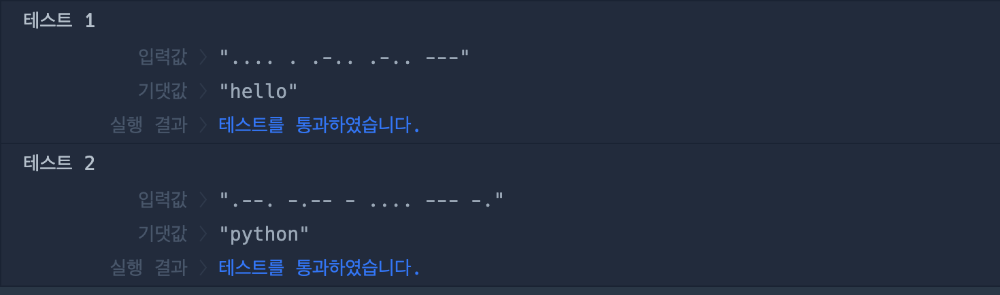

# 🔖 모스부호 (1)

## `📌 문제`

###### 문제 설명

머쓱이는 친구에게 모스부호를 이용한 편지를 받았습니다. 그냥은 읽을 수 없어 이를 해독하는 프로그램을 만들려고 합니다. 문자열 `letter`가 매개변수로 주어질 때, `letter`를 영어 소문자로 바꾼 문자열을 return 하도록 solution 함수를 완성해보세요.
모스부호는 다음과 같습니다.

```
morse = { 
    '.-':'a','-...':'b','-.-.':'c','-..':'d','.':'e','..-.':'f',
    '--.':'g','....':'h','..':'i','.---':'j','-.-':'k','.-..':'l',
    '--':'m','-.':'n','---':'o','.--.':'p','--.-':'q','.-.':'r',
    '...':'s','-':'t','..-':'u','...-':'v','.--':'w','-..-':'x',
    '-.--':'y','--..':'z'
}
```

------

##### 제한사항

- 1 ≤ `letter`의 길이 ≤ 1,000
- return값은 소문자입니다.
- `letter`의 모스부호는 공백으로 나누어져 있습니다.
- `letter`에 공백은 연속으로 두 개 이상 존재하지 않습니다.
- 해독할 수 없는 편지는 주어지지 않습니다.
- 편지의 시작과 끝에는 공백이 없습니다.

------

##### 입출력 예

| letter                    | result   |
| ------------------------- | -------- |
| ".... . .-.. .-.. ---"    | "hello"  |
| ".--. -.-- - .... --- -." | "python" |

------

##### 입출력 예 설명

입출력 예 #1

- .... = h
- . = e
- .-.. = l
- .-.. = l
- --- = o
- 따라서 "hello"를 return 합니다.

입출력 예 #2

- .--. = p
- -.-- = y
- \- = t
- .... = h
- --- = o
- -. = n
- 따라서 "python"을 return 합니다.

------

- a ~ z에 해당하는 모스부호가 순서대로 담긴 배열입니다.
- `{".-","-...","-.-.","-..",".","..-.","--.","....","..",".---","-.-",".-..","--","-.","---",".--.","--.-",".-.","...","-","..-","...-",".--","-..-","-.--","--.."}`


## `✏️ 풀이`

```javascript
function solution(letter) {
    var answer = '';
    const morse = { 
        '.-':'a','-...':'b','-.-.':'c','-..':'d','.':'e','..-.':'f',
        '--.':'g','....':'h','..':'i','.---':'j','-.-':'k','.-..':'l',
        '--':'m','-.':'n','---':'o','.--.':'p','--.-':'q','.-.':'r',
        '...':'s','-':'t','..-':'u','...-':'v','.--':'w','-..-':'x',
        '-.--':'y','--..':'z'
    };
    let letterArray = letter.split(' ');
  
    for(let e of letterArray)  {
        for(const v in morse)
            if(e === v) 
                answer += morse[v];
    }
    
    return answer;
}
```

> 입력 받은 부스부호 문자열를 단어로 변환하는 문제이다.
>
> 일단 문자열을 split()메서드를 통해 공백을 기준으로 나누어 주었다.
>
>  그런 다음 for...of 문을 통해 배열의 요소들을 반복하고, for...in을 통해 morse 객체를 반복한다. 배열을 순회하면서 객체에 접근하여 배열의 요소가 객체의 키와 같을 경우, answer에 객체의 값을 더해 할당한다.


## `🔍 다른 사람 풀이`

```javascript
// 다른 사람 풀이
function solution(letter) {
    let morse = { 
        '.-':'a','-...':'b','-.-.':'c','-..':'d','.':'e','..-.':'f',
        '--.':'g','....':'h','..':'i','.---':'j','-.-':'k','.-..':'l',
        '--':'m','-.':'n','---':'o','.--.':'p','--.-':'q','.-.':'r',
        '...':'s','-':'t','..-':'u','...-':'v','.--':'w','-..-':'x',
        '-.--':'y','--..':'z'
    };
    return letter.split(' ').map(v=>morse[v]).join('');
}
```

> for문을 사용하지 않고 map() 메서드를 활용하여 푼 문제이다. split() 메서드를 통해 받은 매개변수 문자열들을 자르고 map()메서드를 통해 배열을 순회하면서 배열의 요소를 키값과 같은 경우 반환하고, join() 메서드를 통해 문자열들을 다시 합쳐 주었다. 


## `💻 출력 결과`


