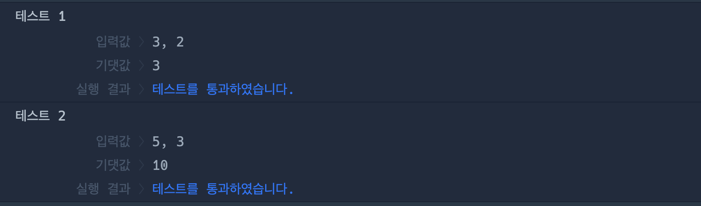

# 🔖 구슬을 나누는 경우의 수

## `📌 문제`

###### 문제 설명

머쓱이는 구슬을 친구들에게 나누어주려고 합니다. 구슬은 모두 다르게 생겼습니다. 머쓱이가 갖고 있는 구슬의 개수 `balls`와 친구들에게 나누어 줄 구슬 개수 `share`이 매개변수로 주어질 때, `balls`개의 구슬 중 `share`개의 구슬을 고르는 가능한 모든 경우의 수를 return 하는 solution 함수를 완성해주세요.

------

##### 제한사항

- 1 ≤ `balls` ≤ 30
- 1 ≤ `share` ≤ 30
- 구슬을 고르는 순서는 고려하지 않습니다.
- `share` ≤ `balls`

------

##### 입출력 예

| balls | share | result |
| ----- | ----- | ------ |
| 3     | 2     | 3      |
| 5     | 3     | 10     |

------

##### 입출력 예 설명

입출력 예 #1

- 서로 다른 구슬 3개 중 2개를 고르는 경우의 수는 3입니다. 

입출력 예 #2

- 서로 다른 구슬 5개 중 3개를 고르는 경우의 수는 10입니다.

------

##### Hint

- 서로 다른 n개 중 m개를 뽑는 경우의 수 공식은 다음과 같습니다.
-  

## `✏️ 풀이`

```javascript
function solution(balls, share) {
    var answer = 0;
    answer = factorial(balls) / (factorial(balls-share) * factorial(share));
    
    return answer;
}

function factorial(num) {
    let n = BigInt(1);
    
    for (let i = num; i > 1; i--) {
        n *= BigInt(i);
    }
    
    return n;
}
```

> 경우의 수를 구하는 문제이다. 서로 다른 n개중 m개를 뽑는 경우의 수 공식은 ` n! / (n-m)! * m!` 이므로 팩토리얼을 이용해서 문제를 풀어야한다. 팩토리얼을 구하기 위한 함수를 선언하고 BigInt()를 사용하여 큰 정수가 나와도 표현할 수 있게 지정하였다. 
>
> for문을 사용하여 i에 매개변수 num을 할당하고, i가 1보다는 커야한다. 후에 후위 연산자를 통해 감소하게 한다.
>
> number에 매개변수 num으로 시작하여 -가 되는데, 팩토리얼은 n * n-1 *  n-2... 형식이므로 number*= BigInt(i)를 하였다.

- BigInt()
  - number 원시 값이 안정적으로 나타낼 수 있는 최대치인 2^53 - 1보다 큰 정수를 표현할 수 있는 내장 객체
  - BigInt는 내장 Math객체의 메서드와 함께 사용할 수 없고, 연산에서 `Number`와 혼합해 사용할 수 없다. 따라서 먼저 같은 자료형으로 변환해야 한다. 그러나, BigInt가 Number로 바뀌면 정확성을 잃을 수 있으니 주의해야 한다
  - 특정 상황에서는 Number 처럼 행동한다
    - Boolean 함수를 사용해 Boolean 객체로 변환
    - 논리 연산자와 같이 사용
    - if문 등 조건 판별시


## `🔍 다른 사람 풀이`

```javascript
// 다른 사람 풀이
const 팩토리얼 = (num) => num === 0 ? 1 : num * 팩토리얼(num - 1)

function solution(balls, share) {
  return Math.round(팩토리얼(balls) / 팩토리얼(balls - share) / 팩토리얼(share))
}
```

> 재귀 함수를 통해 풀이한 과정이다. 함수 표현식에 화살표 함수와 삼항연산자로  재귀함수를 구현하였다. 재귀함수를 통해 팩토리얼을 쉽게 구할 수 있는 것 같다.


## `💻 출력 결과`

