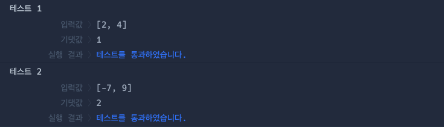

# 🔖 점의 위치 구하기

## `📌 문제`

###### 문제 설명

사분면은 한 평면을 x축과 y축을 기준으로 나눈 네 부분입니다. 사분면은 아래와 같이 1부터 4까지 번호를매깁니다.


- x 좌표와 y 좌표가 모두 양수이면 제1사분면에 속합니다.
- x 좌표가 음수, y 좌표가 양수이면 제2사분면에 속합니다.
- x 좌표와 y 좌표가 모두 음수이면 제3사분면에 속합니다.
- x 좌표가 양수, y 좌표가 음수이면 제4사분면에 속합니다.

x 좌표 (x, y)를 차례대로 담은 정수 배열 `dot`이 매개변수로 주어집니다. 좌표 `dot`이 사분면 중 어디에 속하는지 1, 2, 3, 4 중 하나를 return 하도록 solution 함수를 완성해주세요.

------

#### 제한사항

- `dot`의 길이 = 2
- `dot[0]`은 x좌표를, `dot[1]`은 y좌표를 나타냅니다
- -500 ≤ `dot`의 원소 ≤ 500
- `dot`의 원소는 0이 아닙니다.

------

#### 입출력 예

| dot     | result |
| ------- | ------ |
| [2, 4]  | 1      |
| [-7, 9] | 2      |

------

#### 입출력 예 설명

입출력 예 #1

- `dot`이 [2, 4]로 x 좌표와 y 좌표 모두 양수이므로 제 1 사분면에 속합니다. 따라서 1을 return 합니다.

입출력 예 #2

- `dot`이 [-7, 9]로 x 좌표가 음수, y 좌표가 양수이므로 제 2 사분면에 속합니다. 따라서 2를 return 합니다.


## `✏️ 풀이`

```javascript
function solution(dot) {
    var answer = 0;
    
    answer = dot[0] > 0 ? dot[1] > 0 ? 1 : 4 : dot[1] > 0 ? 2 : 3;

    return answer;
}
```

> 제 1사분면은 dot[0]이 양수이면서 dot[1]도 양수여야하고, 제 2사분면은 dot[0]이 음수이면서 dot[1]이 양수, 제 3사분면은 dot[0]이 음수 dot[1]이 음수, 제 4사분면은 dot[0]이 양수 dot[1]이 음수여야한다. 이러한 조건을 맞추기 위해 삼항연산자로 문제를 풀고 해당되는 사분면을 반환하였다.


## `🔍 다른 사람 풀이`

```javascript
// 다른 사람 풀이
function solution(dot) {
    const [num,num2] = dot;
    const check = num * num2 > 0;
    return num > 0 ? (check ? 1 : 4) : (check ? 3 : 2);
}
```

> num과 num2를 구조 분해 할당하여 각각을 저장시킨다.
>
> check에 두 수를 곱했을때 양수일 경우를 할당하여 삼항연산식을 간단히 구현하였다.


## `💻 출력 결과`

