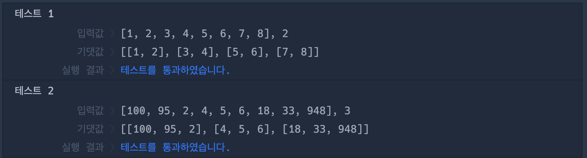

# 🔖 2차원으로 만들기

## `📌 문제`

###### 문제 설명

정수 배열 `num_list`와 정수 `n`이 매개변수로 주어집니다. `num_list`를 다음 설명과 같이 2차원 배열로 바꿔 return하도록 solution 함수를 완성해주세요.

`num_list`가 [1, 2, 3, 4, 5, 6, 7, 8] 로 길이가 8이고 `n`이 2이므로 `num_list`를 2 * 4 배열로 다음과 같이 변경합니다. 2차원으로 바꿀 때에는 num_list의 원소들을 앞에서부터 n개씩 나눠 2차원 배열로 변경합니다.

| num_list                 | n    | result                           |
| ------------------------ | ---- | -------------------------------- |
| [1, 2, 3, 4, 5, 6, 7, 8] | 2    | [[1, 2], [3, 4], [5, 6], [7, 8]] |

------

##### 제한사항

- `num_list`의 길이는 `n`의 배 수개입니다.
- 0 ≤ `num_list`의 길이 ≤ 150
- 2 ≤ `n` < `num_list`의 길이

------

##### 입출력 예

| num_list                           | n    | result                                   |
| ---------------------------------- | ---- | ---------------------------------------- |
| [1, 2, 3, 4, 5, 6, 7, 8]           | 2    | [[1, 2], [3, 4], [5, 6], [7, 8]]         |
| [100, 95, 2, 4, 5, 6, 18, 33, 948] | 3    | [[100, 95, 2], [4, 5, 6], [18, 33, 948]] |

------

##### 입출력 예 설명

입출력 예 #1

- `num_list`가 [1, 2, 3, 4, 5, 6, 7, 8] 로 길이가 8이고 `n`이 2이므로 2 * 4 배열로 변경한 [[1, 2], [3, 4], [5, 6], [7, 8]] 을 return합니다.

입출력 예 #2

- `num_list`가 [100, 95, 2, 4, 5, 6, 18, 33, 948] 로 길이가 9이고 `n`이 3이므로 3 * 3 배열로 변경한 [[100, 95, 2], [4, 5, 6], [18, 33, 948]] 을 return합니다.


## `✏️ 풀이`

```javascript
function solution(num_list, n) {
    var answer = [];
    
    for(let i = 0; i < num_list.length / n; i++) {
        answer = [...answer, num_list.slice(i * n, i * n + n)]
    }
    return answer;
}
```

> 입력받은 n개로 2차원 배열을 만들기 위해 for 반복문을 사용하였다.
>
> num_list.length를 입력받은 n개 만큼 나누만큼 반복하고 answer에 스프레드 기법과 slice 메서드를 사용하여 배열을 추가하였다.
>
> `num_list`가 [1, 2, 3, 4, 5, 6, 7, 8]이고, n의 값이 2일때 맨 처음 for문은  i는 0이므로, slice(0, 0+2)가되어  answer에는 [[1, 2]]가 넣어진다.
>
> i가 1일때, 기존 answer을 스프레드 기법을 사용하여 얕은 복사하여 할당하고, slice(2, 2+2)가 되어 [3, 4] 가 삽입되어 answer 변수는 [[1, 2], [3, 4]]가 된다. 이렇게 반복을 하면 풀이가 나온다.


## `🔍 다른 사람 풀이`

```javascript
// 다른 사람 풀이
function solution(num_list, n) {
    return Array(num_list.length / n).fill([]).map(() => num_list.splice(0, n))
}
```

> Array() 생성자를 사용하여 푼 방식이다.
>
> Array() 생성자를 사용하여 Array 객체를 num_list의 길이를 n으로 나눈만큼의 배열 생성한다.
>
> fill 메서드를 사용하여 []으로 채웠고, 고차함수 map 메서드를 사용하여 num_list를 splice 메서드를 사용하여 0부터 입력받은 n만큼 자르고 반환한다. splice 메서드는 slice 배열과 달리 원본 배열을 변형시킨다.


## `💻 출력 결과`

