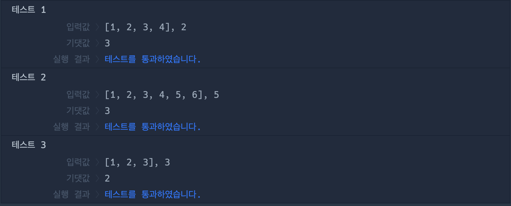

# 🔖 공 던지기

## `📌 문제`

###### 문제 설명

머쓱이는 친구들과 동그랗게 서서 공 던지기 게임을 하고 있습니다. 공은 1번부터 던지며 오른쪽으로 한 명을 건너뛰고 그다음 사람에게만 던질 수 있습니다. 친구들의 번호가 들어있는 정수 배열 `numbers`와 정수 `K`가 주어질 때, `k`번째로 공을 던지는 사람의 번호는 무엇인지 return 하도록 solution 함수를 완성해보세요.

------

##### 제한사항

- 2 < `numbers`의 길이 < 100
- 0 < `k` < 1,000
- `numbers`의 첫 번째와 마지막 번호는 실제로 바로 옆에 있습니다.
- `numbers`는 1부터 시작하며 번호는 순서대로 올라갑니다.

------

##### 입출력 예

| numbers            | k    | result |
| ------------------ | ---- | ------ |
| [1, 2, 3, 4]       | 2    | 3      |
| [1, 2, 3, 4, 5, 6] | 5    | 3      |
| [1, 2, 3]          | 3    | 2      |

------

##### 입출력 예 설명

입출력 예 #1

- 1번은 첫 번째로 3번에게 공을 던집니다.
- 3번은 두 번째로 1번에게 공을 던집니다.

입출력 예 #2

- 1번은 첫 번째로 3번에게 공을 던집니다.
- 3번은 두 번째로 5번에게 공을 던집니다.
- 5번은 세 번째로 1번에게 공을 던집니다.
- 1번은 네 번째로 3번에게 공을 던집니다.
- 3번은 다섯 번째로 5번에게 공을 던집니다.

입출력 예 #3

- 1번은 첫 번째로 3번에게 공을 던집니다.
- 3번은 두 번째로 2번에게 공을 던집니다.
- 2번은 세 번째로 1번에게 공을 던집니다.


## `✏️ 풀이`

```javascript
function solution(numbers, k) {
    var answer = 0;
    
    for (let i = 0; i < k; i++) {
        if (answer >= numbers.length) {
            answer -= numbers.length;
        }
        answer += 2;
    }
    return numbers[answer-2];
}
```

> 배열이 [1, 2, 3, 4]일때, 1번은 3번, 2번은 1번, 3번은 3번... 이런 형식으로 던지므로 배열의 인덱스에 2를 더해주면 된다는 규칙을 찾을 수 있다.
>
> for 반복문을 사용하여 k가 i보다 작을 때까지 반복하고 만약 answer값이 배열의 길이와 같거나 크면 배열의 길이만큼 빼주었다.
>
> 그후에 answer 변수에 2를 더했다. 배열의 요소를 찾는것이므로, return에 number[answer-2]를 해주었다.


## `🔍 다른 사람 풀이`

```javascript
// 다른 사람 풀이
function solution(numbers, k) {
    return numbers[(--k*2)%numbers.length];
}
```

> 이 풀이에서는 numbers의 반복문 없이 요소를 접근하여 입력받은 k를 전위 연산자 --를 사용하여 빼고 곱하기 2를 한 다음,  나머지 연산자를 사용하여 배열의 길이만큼 나누어주었다. 이 코드를 한줄로 출력할 수 있다는 것에 감탄이 나왔다. 


## `💻 출력 결과`


