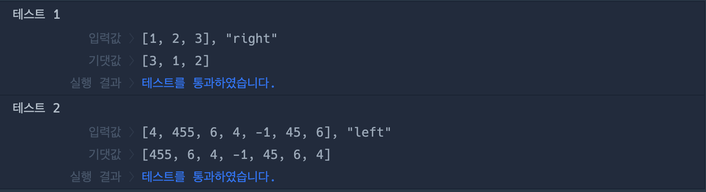

# 🔖 배열 회전시키기

## `📌 문제`

###### 문제 설명

정수가 담긴 배열 `numbers`와 문자열 `direction`가 매개변수로 주어집니다. 배열 `numbers`의 원소를 `direction`방향으로 한 칸씩 회전시킨 배열을 return하도록 solution 함수를 완성해주세요.

------

##### 제한사항

- 3 ≤ `numbers`의 길이 ≤ 20
- `direction`은 "left" 와 "right" 둘 중 하나입니다.

------

##### 입출력 예

| numbers                   | direction | result                    |
| ------------------------- | --------- | ------------------------- |
| [1, 2, 3]                 | "right"   | [3, 1, 2]                 |
| [4, 455, 6, 4, -1, 45, 6] | "left"    | [455, 6, 4, -1, 45, 6, 4] |

------

##### 입출력 예 설명

입출력 예 #1

- `numbers` 가 [1, 2, 3]이고 `direction`이 "right" 이므로 오른쪽으로 한 칸씩 회전시킨 [3, 1, 2]를 return합니다.

입출력 예 #2

- `numbers` 가 [4, 455, 6, 4, -1, 45, 6]이고 `direction`이 "left" 이므로 왼쪽으로 한 칸씩 회전시킨 [455, 6, 4, -1, 45, 6, 4]를 return합니다.


## `✏️ 풀이`

```javascript
function solution(numbers, direction) {
    var answer = [];
    let temp = 0;
    
    if (direction === 'left') {
        temp = numbers.shift();
        answer=[...numbers, temp];
    }
    if (direction === 'right') {
        temp = numbers.pop()
        answer=[temp, ...numbers];
    }
    return answer;
}
```

> right일 때 오른쪽으로 한 칸씩 회전시키므로 제일 오른쪽에 있는 요소를 제거한 후, 가장 왼쪽의 요소앞에 삽입시키면된다.
>
> 임시 변수 temp에 0을 할당하여 선언과 초기화를 하고, 두번째 매개변수에 따라 if 문을 사용하여 작동하게 하였다.
>
> shift 메서드와 pop 메서드는 배열을 제거한 후, 반환받는 메서드고, 기존 배열을 변형시킨다.
>
> 후에 스프레드 기법을 통해 배열을 복사한후, 할당을 해주었다.


## `🔍 다른 사람 풀이`

```javascript
// 다른 사람 풀이
function solution(numbers, direction) {
  return direction === "right"
    ? [numbers[numbers.length - 1], ...numbers.slice(0, numbers.length - 1)]
    : [...numbers.slice(1), numbers[0]];
}
```

> 이 풀이는 원본 배열을 변형시키지 않고 삼항 연산자를 사용하여 푼 방식이다.
>
> slice 메서드는 자르고 새로운 배열을 반환한다.


## `💻 출력 결과`

