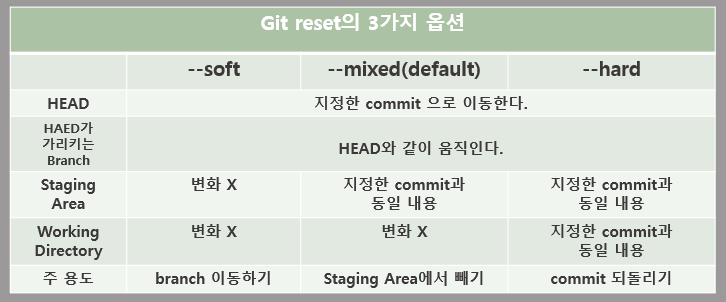

# Git 명령어 모음

[TOC]

## 기본 명령어

### `git init` : 저장소 만들기

- 로컬 Git 저장소 설정

### `git status` : 현재 상태 확인

- 현재 작업 중인 파일의 상태 확인
- `#gst`

### `git add [-A] [<pathspec>...]`  : 현재 상태 추적

- 파일 변경사항을 인덱스에 추가
- `#gaa`(전체파일 인덱스 추가)

### `git commit [-m <msg>]`  : 현재 상태 저장

- 인덱스에 추가된 변경 사항을 이력에 추가
- `-m` 옵션을 사용하여 간단하게 이력에 대한 메시지 작성
- `#gc -m <msg>`

### `git log [<options>] [<revision range>] [[--] <path>...]`  : 이력 확인

- 다양한 옵션을 조합하여 원하는 형태의 로그를 출력할 수 있는 강력한 기능 

### `git reset [<commit>] [--soft | --mixed [-N] | --hard | --merge | --keep]`  : 이전 상태로 (이력 제거)

- 특정 커밋까지 이력을 초기화
- 바로전이나 n번 전까지 작업했던 내용 취소 가능
- 작업을 했지만 작업한 내용이 필요 없어질 때 사용
- 커밋 아이디는 앞에 7자 정도 복사해도 진행됨
  - ```bash
    git reset 27a00b7 --hard
    ```
- 주의❗️이력이 지워짐

- 

### `git revert <commit>...`  : 이전 상태로 (이력 유지)

- 특정 커밋을 취소하는 새로운 커밋을 만듦
- 기존 이력을 유지
- 특정 버전을 배포했는데 문제가 생기면 문제가 생긴 커밋을 `revert` 함
  - 빠른 조치 및 롤백
- 다시 원복한 상태로 작업을 이어서 하고 해당 문제를 수정하면 다시 커밋하는 방식으로 사용
  - ```bash
    git revert 306b947
    ```


## 작업 분기

### `git switch (-c|-C) <new-branch>` : 브랜치 생성 

- `git checkout -b <new-branch>` 와 같은 명령어

- master 브랜치에서 새 브랜치를 만듦

- 새 브랜치를 만들 때, 현재 브랜치 기준으로 만들어짐

- `#gsw <branch-name>`

- > `-c` 옵션 : 브랜치 생성과 브랜치 이동을 한번에 수행

### `git swich <branch-name>` : 브랜치 변경

- 브랜치를 이동하는 명령어

### `git merge [<commit...>]` : 브랜치 합치기

- 작업하고 있는 브랜치를 다른 브랜치와 합치는 명령어

- 기준이 될 브랜치로 이동후, `merge`를 실행

- `#gm [<commit...>]`

- ```bash
  git switch master 
  git merge feature
  git log
  ```


## Conflict : 충돌해결

- 협업을 할때나, 같은 파일을 수정하여 충돌이 발생

- 충돌을 해결하고 커밋을 하거나, 머지 작업을 취소(`git merge --abort`)할 수 있음

- ```bash
  <<<<<<< HEAD
  Main Content
  =======
  Feature Content
  >>>>>>> feature
  ```

  > - 충돌이 발생하면 양쪽 브랜치에서 동시에 변경된 사항을 표시 해주는데 `<<<<<<<`, `=======`, `>>>>>>>` 이 내용이 충돌이 발생한 지점을 의미한다.
  >
  > - `HEAD` 는 `main` 브랜치에서 작업한 내용이고 아래는  `feature` 브랜치에서 작업한 내용이며. 둘중에 어떤 내용이 맞는지 개발자가 스스로 판단하고 선택해야 한다.
  >
  > - 충돌을 해결할려면 `<<<<<<<`, `=======`, `>>>>>>>` 를 제거하고  `main` 브랜치 또는 `feature` 브랜치 중 원하는 내용을 선택하고 필요없는 부분은 지우면 된다.

- 충돌을 해결했다면 `git commit`에서 `-m` 메시지를 입력하지 않고 진행

  - ✔️ 충돌을 수정한 내용을 자동으로 메시지로 만들기 때문에 따로 입력하지 않아도 됨


## GitHub 공유

### `git remote add <name> <url>` : 원격 저장소 연결

- 로컬 저장소에 원격 저장소를 연결

- `name`은 보통 `origin`을 사용

- > ❓ https vs ssh
  >
  > 원격 저장소의 주소를 설정할 때, https와 ssh를 선택할 수 있다. https는 아이디/패스워드 방식을 사용하고 ssh는 개인키와 공개키를 이용한다.

### `git push [-u | --set upstream] [<repository> [<refspec>...]] ` : 원격 저장소 저장

- 설정한 원격 저장소에 로컬 저장소의 모든 commit을 push하여 저장

- > `-u` 옵션 : push할 때 별다른 원격 저장소 이름을 지정하지 않고 `git push` 사용 가능

- `#gp -u origin <branch-name>`

- ```bash
  git push -u origin main
  ```

### `git clone <repository> [<directory>]` : 원격 저장소 복제

- 원격 저장소를 로컬 저장소로 가져오는 명령어
- 두번째 인자(<directory)>를 입력하면 별도의 폴더 이름을 지정할 수 있으며, 비우면 원격 저장소의 이름을 그대로 사용한다. 

### `git pull [<reository> [<refspec>...]]` : 원격 저장소 내용 가져오기

- 원격 저장소에 변경된 내용을 로컬 저장소로 가져오는 명령어

- Git은 원격 저장소와 로컬 저장소를 자동으로 동기화하지 않음

- `#gl`

- > ❗️중요 : 원격 저장소와 로컬 저장소의 차이가 커지면 추후에 충돌이 많이 발생하기 때문에 `git pull` 명령어는 자주 수행하는 것이 좋다.

  
  
  