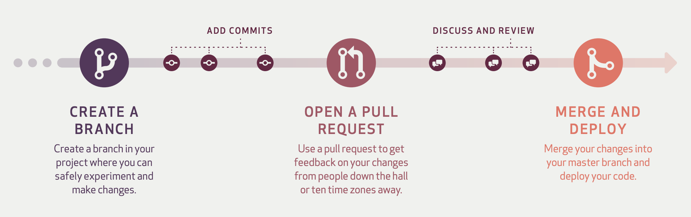

# GitHub Flow

- GitHub에서 제공하는 `Pull Request` 와 `Code Review` 기능을 적극적으로 활용한 방식
- GitHub에서 제안하는 프로젝트 관리방법
- 

> 💡 Tip :로컬 브랜치를 모두 원격 브랜치로 연동할 필요는 없다. 보통 로컬 브랜치에서 작업을 하다가 의미가 있다고 판단이 될 때 원격 저장소로 푸시하게 된다.