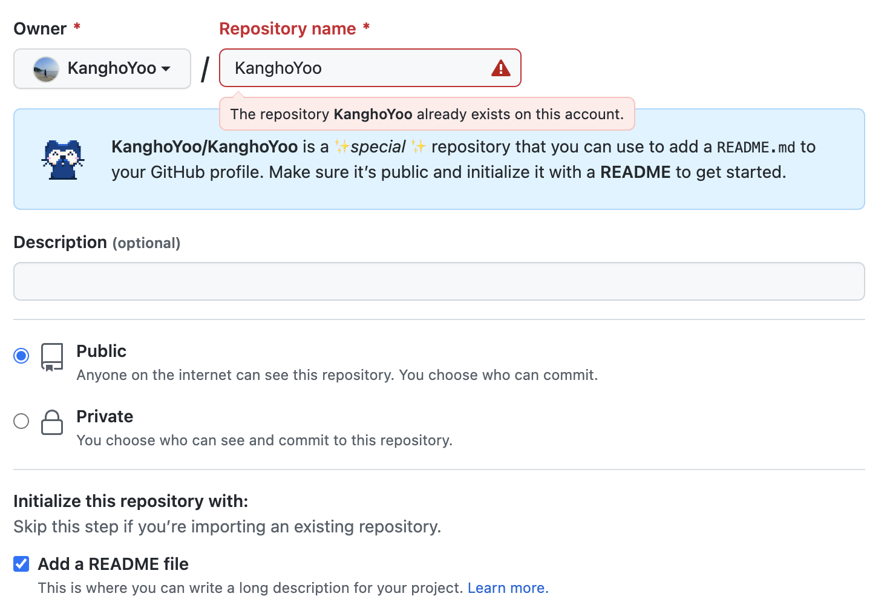
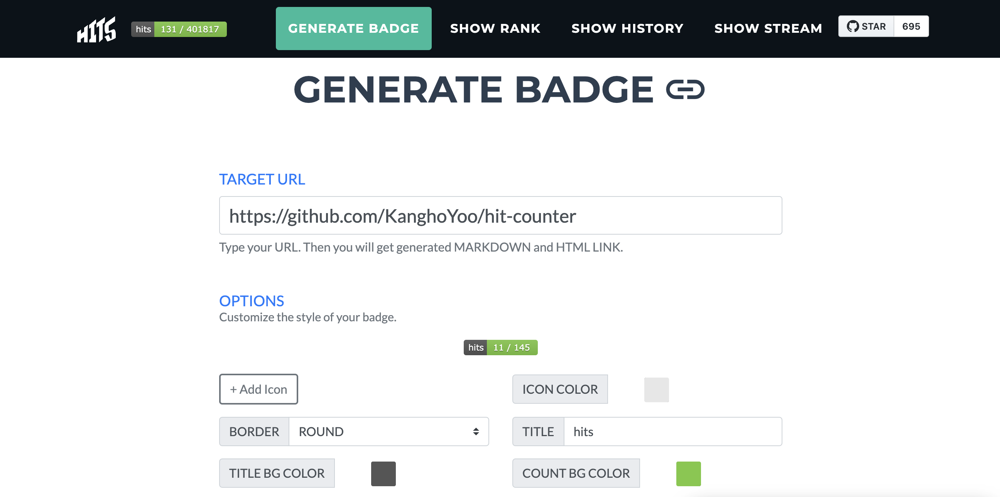
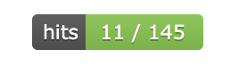
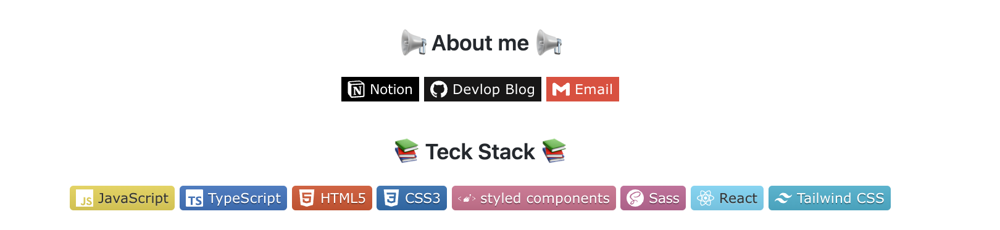
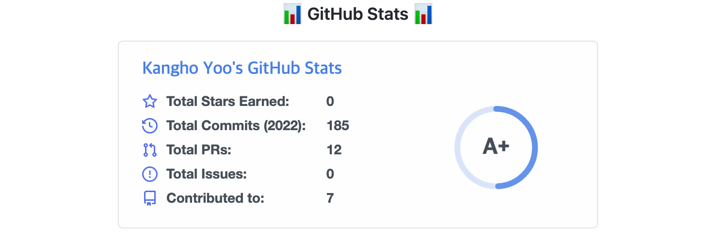

# GitHub Profile 꾸미기

### 1. Repository 생성



- GitHub 계정 이름과 동일하게 Repository를 생성
- Repository name 하단에 Repository에 `README` 파일로 GitHub Profile을 사용할 수 있다고 알려줌
- `Add a README file` 체크


### 2. Readme.md 수정

- 마크다운 문법을 활용하여 `Readme.md` 파일의 내용 작성

#### 2-1. Header

- **capsule-render** 이용

  - https://github.com/kyechan99/capsule-render

  - [capsule-render]: https://github.com/kyechan99/capsule-render	"capsule-render"

  - 원하는 커스텀을 한 후, 코드 적용
  
  - 

#### 2-2. Hits

- **hits.seeyoufarm** 이용

  - [HITS]: https://hits.seeyoufarm.com/

  - 링크 접속 후, Target url 부분의 자신의 "깃헙주소/hit-counter" 입력
  - 원하는 커스텀을 한 후, 코드 적용
  - 
  - 

#### 2-3. Badge

- **shields.io** 와 **Simple Icons** 이용

  - [shields.io]: https://shields.io/

  - 링크 이동 형식 예시

    - ```markdown
       <a href="클릭시 이동할 링크" target="_blank"></a>
      ```

  - 이미지 형식 예시

    - ```markdown
      
      ```

  - [Simple Icons]: https://simpleicons.org/

    - 아이콘 색상코드와 아이콘 이름을 검색할 수 있는 사이트

  - 

#### 2-4. Git Stats

- **Git-readme-stats** 이용

  - [Git-readme-stats]: https://github.com/anuraghazra/github-readme-stats

  - GitHub 통계

  - 원하는 테마 등 커스텀 후, 코드 적용

  - 코드 예시

    - ```markdown
      
      ```

  - 