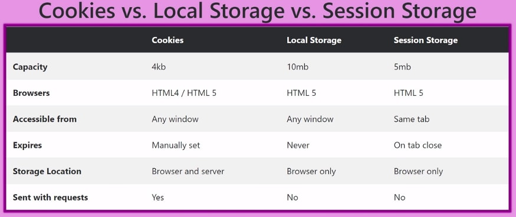

# 개발자 도구

## 개발자 도구

- 브라우저에 제공하는 하나의 도구
- 웹을 즉각적으로 수정하고 문제발생시 원인을 파악하여 빠른속도로 더 나은사이트를 제작할 수 있게 도움을 줌

### 개발자 도구 실행

- 개발자 도구 열기 : `cmd + option + i`
- 요소 패널 열기 : `cmd + option + c`
- 콘솔 패널 열기 : `cmd + option + j`

---

### Elements panel

- HTML 코드를 분석하고 실시간으로 수정할 수 있는 도구 패널
- DOM과 CSS를 조작하여 웹의 레이아웃과 디자인을 테스트 할 수 있음

- 웹 페이지의 구성 (DOM)
- 구성 요소의 스타일 속성(CSS)
- CSS, UI 수정 등

### user agent stylesheet

- 브라우저의 기본 스타일 값을 의미하며, 브라우저 마다 스타일 기본값이 다름
- 브라우저의 종류에 따라 기본적으로 설정되어 있는 속성 값이 다르기 때문에 개발 시작 단계에서 `reset.css` 혹은 `normalize.css` 파일에서 기본 스타일 값을 모두 초기화 시키고 작업을 시작하면 브라우저의 종류에 상관 없이 동일한 화면 출력 가능

---

### Console panel

- JavaScript Code 즉시 실행
- 디버깅

### console 객체

- console은 객체이며, log 메소드에 포함한 다양한 메소드가 존재
- 프론트엔드의 경우 실제로 디버깅 시 다른 도구를 사용하는 것보다 `console.log` 를 활용하는 경우가 대부분
- 백엔드에서 보내주는 response(에러 메세지, status 코드 등)도 `console.log`를 활용해 확인 가능하며 상황을 명확하게 알려주는 resopnse 메세지와 적절한 status 코드를 전달해 주는 것이 중요

---

### Network panel

- HTTP 네트워크 통신 확인
- API 크롤링, 페이지 로딩 성능 테스트
- 이미지, 영상 등의 소스 (Mock data 활용)

- `XHR(Xml(Extensible Markup Language) Http Request)` : 브라우저와 서버가 HTTP 통신 할 때 request가 어떻게 구성되어 서버로 전달 되는지, 서버로 부터 요청에 따른 response 결과를 확인할 때 사용

---

### Application panel

- 브라우저 저장소

- Local storage, Session Storage, Cookie

  - Storage **:** 브라우저 저장소

  - Local Storage **:** 데이터의 영구성이 보장되며, Key-Value 페어의 객체 형태로 데이터 저장됨

  - Session Storage **:** 윈도우나 브라우저 탭을 닫을 경우 제거되며, Key-Value 페어의 객체 형태로 데이터 저장됨

  - Cookie : 시간 제한 설정이 가능하며, 쿠키는 프론트와 백엔드 통신에 관련이 있기 때문에 용량이 작을 수 밖에 없으며, Key-Value 페어의 문자열 형태로 데이터 저장되어 세미콜론으로 구분할 수 있음. 텍스트 타입이라 문자열만 저장
  - 

### **Local Storage, Session Storage, Cookie 활용 예시**

**Local Storage**

- 지속적으로 필요한 데이터(data persistant) - ID 저장, 비회원 카트
- UI 정보들 - 에어비앤비, 스카이스캐너 인천공항(베네치아 검색하면 그대로 유지)

**Session Storage**

- 잠깐 동안 필요한 정보
- ex. 보안이 중요한 정보, specific한 유저 정보, 언어 선택

**Cookie**

- 서비스 직접적이지 않은 데이터
- 오늘만 하는 이벤트 팝업, 서비스 약관에 동의했는지 등.

❗️비밀번호와 같은 중요정보는 스토리지에 저장하면 위험함. 로컬스토리지나 세션스토리지는 클라이언트 사이드이기 때문에 쉽게 해킹 위험에 노출되어 있음. 사이트와 서비스의 특성, 회사의 방침에 따라 user data 를 어떻게 처리 하는지 전부 다르기 때문에 서비스 특성이나 기획에 맞게 적절하게 처리해야 함

### Local Storage 에 특정 데이터를 저장하고 가져오는 방법

**데이터 저장**

- `localStorage.setItem("key", "value")`
- `sessionStorage.setItem("key", "value")`
- `setcookie("key", "value", "지속시간(초단위)")`

**데이터 호출**

- `localStorage.getItem("key")`
- `sessionStorage.getItem("key")`
- `document.cookie`

**기타 메소드**

- 외에도 `removeItem`, `clear` 등의 공통 메소드 존재
