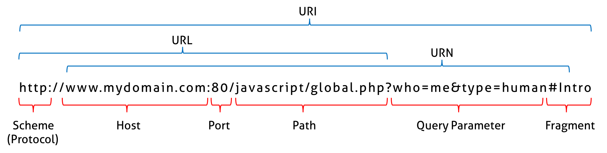

# 🔖 21장, 빌트인 객체

## `📌 배운 내용 및 기억하고 싶은 내용`

### 자바스크립트 객체의 분류

- 표준 빌트인 객체: ECMAScript 사양에 정의된 객체를 의미하며 애플리케이션 전역의 공통기능을 제공
  - 자바스크립트 실행환경과 관계없이 언제나 사용 가능
  - 전역 객체의 프로퍼티로서 제공됨
  - 별도의 선언 없이 전역 변수처럼 언제나 참조가능
- 호스트 객체: 자바스크립트 실행환경에서 추가로 제공하는 객체
  - 브라우저 환경에서는 Web API를 호스트 객체로 제공
  -  Node.js 환경에서는  Node.js고유의 호스트 객체로 제공
- 사용자 정의 객체: 사용자가 직접 정의한 객체


### 표준 빌트인 객체

- 생성자 함수 객체인 표준 빌트인 객체: 프로토타입 메서드와 정적 메서드 제공
  - Math, Reflect, JSON을 제외한 표준 빌트인 객체는 모두 인스턴스를 생성할 수 있는 생성자 함수 객체
- 생성자 함수 객체가 아닌 표준 빌트인 객체: 정적 메서드만 제공


### 원시값과 래퍼객체

- 래퍼객체: 문자열, 숫자, 불리언 값에 대해 객체처럼 접근하면 생성되는 임시 객체

- ```js
  const str = 'hi';
  
  // 원시 타입인 문자열이 래퍼 객체인 String 인스턴스로 변환된다.
  console.log(str.length); // 2
  console.log(str.toUpperCase()); // HI
  
  // 래퍼 객체로 프로퍼티에 접근하거나 메서드를 호출한 후, 다시 원시값으로 되돌린다.
  console.log(typeof str); // string
  ```

  래퍼 객체의 처리가 종료되면 래퍼 객체[[StringData]] 내부 슬롯에 할당된 원시값을 원래상태로 되돌리고 래퍼객체는 가비지컬렉션의 대상이 됨
  
- ```js
  // ① 식별자 str은 문자열을 값으로 가지고 있다.
  const str = 'hello';
  
  // ② 식별자 str은 암묵적으로 생성된 래퍼 객체를 가리킨다.
  // 식별자 str의 값 'hello'는 래퍼 객체의 [[StringData]] 내부 슬롯에 할당된다.
  // 래퍼 객체에 name 프로퍼티가 동적 추가된다.
  str.name = 'Lee';
  
  // ③ 식별자 str은 다시 원래의 문자열, 즉 래퍼 객체의 [[StringData]] 내부 슬롯에 할당된 원시값을 갖는다.
  // 이때 ②에서 생성된 래퍼 객체는 아무도 참조하지 않는 상태이므로 가비지 컬렉션의 대상이 된다.
  
  // ④ 식별자 str은 새롭게 암묵적으로 생성된(②에서 생성된 래퍼 객체와는 다른) 래퍼 객체를 가리킨다.
  // 새롭게 생성된 래퍼 객체에는 name 프로퍼티가 존재하지 않는다.
  console.log(str.name); // undefined
  
  // ⑤ 식별자 str은 다시 원래의 문자열, 즉 래퍼 객체의 [[StringData]] 내부 슬롯에 할당된 원시값을 갖는다.
  // 이때 ④에서 생성된 래퍼 객체는 아무도 참조하지 않는 상태이므로 가비지 컬렉션의 대상이 된다.
  console.log(typeof str, str);
  ```

- ```
  const num = 1.5;
  
  // 원시 타입인 숫자가 래퍼 객체인 Number 객체로 변환된다.
  console.log(num.toFixed()); // 2
  
  // 래퍼 객체로 프로퍼티에 접근하거나 메서드를 호출한 후, 다시 원시값으로 되돌린다.
  console.log(typeof num, num); // number 1.5
  ```

- null과 undefined는 래퍼객체를 생성하지 않음


### 전역 객체

- 전역 객체: 코드가 실행되기 이전 단계에 자바스크립트 엔진에 의해 어떤 객체보다도 먼저 생성되는 특수한 객치이며, 어떤 객체에도 속하지 않은 최상위 객체
  - 브라우저 환경: window(self,this,frames)
  - Node.js 환경: global
- globalThis
  - ES11에 도입
  - 브라우저환경과 node.js 환경에서 전역 객체를 가리키던 다양한 식별잘을 통일한 식별자
- 전역 객체는 표준 빌트인 객체, 환경에 따른 호스트 객체, var키워드로 선언한 전역 변수와 전역함수를 프로퍼티로 가짐
  - 계층적 구조상 어떤 객체에 속하지 않은 모든 빌트인 객체의 최상위
- 전역 객체의 특징
  - 전역 객체는 개발자가 의도적으로 생성할 수 없음
  - 전역 객체의 프로퍼티를 참조할때 window(global) 생략 가능

#### 빌트인 전역 프로퍼티

- 전역 객체의 프로퍼티를 의미
- 애플리케이션 전역에서 사용하는 값을 제공

##### Infinify

Infinity프로퍼티는 무한대를 나타내는 숫자값 Infinity을 가짐

```js
// 전역 프로퍼티는 window를 생략하고 참조할 수 있다.
console.log(window.Infinity === Infinity); // true

// 양의 무한대
console.log(3/0);  // Infinity
// 음의 무한대
console.log(-3/0); // -Infinity
// Infinity는 숫자값이다.
console.log(typeof Infinity); // number
```

##### NaN

NaN프로퍼티는 숫자값 NaN을 가짐

##### undefined

undefined프로퍼티는 원시타입 undefined을 가짐

#### 빌트인 전역 함수

- 애플리케이션 전역에서 호출할 수 있는 빌트인 함수
- 전역 객체의 메서드를 의미

##### eval

문자열 코드를 런타임에 평가하여 값을 생성하고, 전달받은 인수가 표현식이 아닌 문이라면 eval 함수는 문자열코드를 런타임에 실행

```js
// 표현식인 문
eval('1 + 2;'); // -> 3
// 표현식이 아닌 문
eval('var x = 5;'); // -> undefined

// eval 함수에 의해 런타임에 변수 선언문이 실행되어 x 변수가 선언되었다.
console.log(x); // 5

// 객체 리터럴은 반드시 괄호로 둘러싼다.
const o = eval('({ a: 1 })');
console.log(o); // {a: 1}

// 함수 리터럴은 반드시 괄호로 둘러싼다.
const f = eval('(function() { return 1; })');
console.log(f()); // 1
```

- 엄격 모드에서는 eval 함수 자신의 자체적인 스코프를 생성

  - ```js
    const x = 1;
    
    function foo() {
      'use strict';
    
      // strict mode에서 eval 함수는 기존의 스코프를 수정하지 않고 eval 함수 자신의 자체적인 스코프를 생성한다.
      eval('var x = 2; console.log(x);'); // 2
      console.log(x); // 1
    }
    
    foo();
    console.log(x); // 1
    ```

- 인수로 전달받은 문자열 코드가 let, const 키워드를 사용한 변수 선언문일 경우, 암묵적으로 엄격모드가 적용됨

- eval 함수는 사용자로 부터 입력받은 콘텐츠를 실행 하는 것은 보안에 매우 취약하고 자바스크립트 엔진에 의해 최적화가 수행되지않아 일반 코드 실행에 비해 처리속도가 느림
  - **eval 함수의 사용은 금지해야함**

##### isFinite

전달 받은 인수가 정상적인 유한수인지 검사하여 유한수면 true반환, 무한수면 false 반환

전달받은 인수의 타입이 숫자가 아닌 경우, 숫자로 타입변환을 한 후 검사를 수행

NaN으로 평가되는 값은 false임

```js
// 인수가 유한수이면 true를 반환한다.
isFinite(0);    // -> true
isFinite(2e64); // -> true
isFinite('10'); // -> true: '10' → 10
isFinite(null); // -> true: null → 0

// 인수가 무한수 또는 NaN으로 평가되는 값이라면 false를 반환한다.
isFinite(Infinity);  // -> false
isFinite(-Infinity); // -> false

// 인수가 NaN으로 평가되는 값이라면 false를 반환한다.
isFinite(NaN);     // -> false
isFinite('Hello'); // -> false
isFinite('2005/12/12'); // -> false
```

##### isNaN

전달받은 인수가 NaN인지 검사하여 그 결과를 불리언 타입으로 반환

인수의 타입이 숫자가 아니면 타입변환을 한 후 검사 수행

`isNaN(NaN)`

##### parseFloat

전달받은 문자열 인수를 부동소수점 숫자로 반환

`parseFloat('문자열')`

```js
// 문자열을 실수로 해석하여 반환한다.
parseFloat('3.14');  // -> 3.14
parseFloat('10.00'); // -> 10

// 공백으로 구분된 문자열은 첫 번째 문자열만 변환한다.
parseFloat('34 45 66'); // -> 34
parseFloat('40 years'); // -> 40

// 첫 번째 문자열을 숫자로 변환할 수 없다면 NaN을 반환한다.
parseFloat('He was 40'); // -> NaN

// 앞뒤 공백은 무시된다.
parseFloat(' 60 '); // -> 60
```

##### parseInt

전달받은 문자열 인수를 정수로 해석하여 반환

```js
// 10'을 10진수로 해석하고 그 결과를 10진수 정수로 반환한다
parseInt('10'); // -> 10
// '10'을 2진수로 해석하고 그 결과를 10진수 정수로 반환한다
parseInt('10', 2); // -> 2
// '10'을 8진수로 해석하고 그 결과를 10진수 정수로 반환한다
parseInt('10', 8); // -> 8
// '10'을 16진수로 해석하고 그 결과를 10진수 정수로 반환한다
parseInt('10', 16); // -> 16

// 16진수 리터럴 '0xf'를 16진수로 해석하고 10진수 정수로 그 결과를 반환한다.
parseInt('0xf'); // -> 15
// 위 코드와 같다.
parseInt('f', 16); // -> 15

// 2진수 리터럴(0b로 시작)은 제대로 해석하지 못한다. 0 이후가 무시된다.
parseInt('0b10'); // -> 0
// 8진수 리터럴(ES6에서 도입. 0o로 시작)은 제대로 해석하지 못한다. 0 이후가 무시된다.
parseInt('0o10'); // -> 0

// 문자열 '10'을 2진수로 해석한다.
parseInt('10', 2); // -> 2
// 문자열 '10'을 8진수로 해석한다.
parseInt('10', 8); // -> 8

// 'A'는 10진수로 해석할 수 없다.
parseInt('A0'); // -> NaN
// '2'는 2진수로 해석할 수 없다.
parseInt('20', 2); // -> NaN

// 10진수로 해석할 수 없는 'A' 이후의 문자는 모두 무시된다.
parseInt('1A0'); // -> 1
// 2진수로 해석할 수 없는 '2' 이후의 문자는 모두 무시된다.
parseInt('102', 2); // -> 2
// 8진수로 해석할 수 없는 '8' 이후의 문자는 모두 무시된다.
parseInt('58', 8); // -> 5
// 16진수로 해석할 수 없는 'G' 이후의 문자는 모두 무시된다.
parseInt('FG', 16); // -> 15

// 공백으로 구분된 문자열은 첫 번째 문자열만 변환한다.
parseInt('34 45 66'); // -> 34
parseInt('40 years'); // -> 40
// 첫 번째 문자열을 숫자로 변환할 수 없다면 NaN을 반환한다.
parseInt('He was 40'); // -> NaN
// 앞뒤 공백은 무시된다.
parseInt(' 60 '); // -> 60
```

##### encodeURI / decodeURI



encodeURI 함수는 완전한 URI를 문자열로 전달받아 이스케이프 처리를 위해 인코딩을 함

- URI: 인터넷에 있는 자원을 나타내는 유일한 주소를 의미

- 인코딩: URI의 문자들을 이스케이프 처리하는 것을 의미

  - 이스케이프 처리: 네트워크를 통해 정보를 공유할 때 어떤 시스템에서도 읽을 수 있는 아스키 문자 셋으로 변환하는 것

- ```js
  // 완전한 URI
  const uri = 'http://example.com?name=이웅모&job=programmer&teacher';
  
  // encodeURI 함수는 완전한 URI를 전달받아 이스케이프 처리를 위해 인코딩한다.
  const enc = encodeURI(uri);
  console.log(enc);
  // http://example.com?name=%EC%9D%B4%EC%9B%85%EB%AA%A8&job=programmer&teacher
  ```

decodeURI 함수는 인코딩된 URI를 인수로 전달받아 이스케이프 처리 이전으로 디코딩함

- ```js
  const uri = 'http://example.com?name=이웅모&job=programmer&teacher';
  
  // encodeURI 함수는 완전한 URI를 전달받아 이스케이프 처리를 위해 인코딩한다.
  const enc = encodeURI(uri);
  console.log(enc);
  // http://example.com?name=%EC%9D%B4%EC%9B%85%EB%AA%A8&job=programmer&teacher
  
  // decodeURI 함수는 인코딩된 완전한 URI를 전달받아 이스케이프 처리 이전으로 디코딩한다.
  const dec = decodeURI(enc);
  console.log(dec);
  // http://example.com?name=이웅모&job=programmer&teacher
  ```

##### encodeURIComponent / decodeURIComponent

encodeURIComponent 함수는 URI 구성요소를 인수로 전달받아 인코딩함

decodeURIComponent 함수는 매개변수로 전달된 URI 구성요소를 디코딩함

- ```js
  // URI의 쿼리 스트링
  const uriComp = 'name=이웅모&job=programmer&teacher';
  
  // encodeURIComponent 함수는 인수로 전달받은 문자열을 URI의 구성요소인 쿼리 스트링의 일부로 간주한다.
  // 따라서 쿼리 스트링 구분자로 사용되는 =, ?, &까지 인코딩한다.
  let enc = encodeURIComponent(uriComp);
  console.log(enc);
  // name%3D%EC%9D%B4%EC%9B%85%EB%AA%A8%26job%3Dprogrammer%26teacher
  
  let dec = decodeURIComponent(enc);
  console.log(dec);
  // 이웅모&job=programmer&teacher
  
  // encodeURI 함수는 인수로 전달받은 문자열을 완전한 URI로 간주한다.
  // 따라서 쿼리 스트링 구분자로 사용되는 =, ?, &를 인코딩하지 않는다.
  enc = encodeURI(uriComp);
  console.log(enc);
  // name=%EC%9D%B4%EC%9B%85%EB%AA%A8&job=programmer&teacher
  
  dec = decodeURI(enc);
  console.log(dec);
  // name=이웅모&job=programmer&teacher
  ```

#### 암묵적 전역

```js
// 전역 변수 x는 호이스팅이 발생한다.
console.log(x); // undefined
// 전역 변수가 아니라 단지 전역 객체의 프로퍼티인 y는 호이스팅이 발생하지 않는다.
console.log(y); // ReferenceError: y is not defined

var x = 10; // 전역 변수

function foo () {
  // 선언하지 않은 식별자에 값을 할당
  y = 20; // window.y = 20;
}
foo();

// 선언하지 않은 식별자 y를 전역에서 참조할 수 있다.
console.log(x + y); // 30
```

> 암묵적 전역으로 선언된 y는 전역 객체의 프로퍼티가 되어 전역 변수처럼 동작하지만 변수가 아니므로 변수 호이스팅은 발생하지 않는다.

```js
var x = 10; // 전역 변수

function foo () {
  // 선언하지 않은 식별자에 값을 할당
  y = 20; // window.y = 20;
  console.log(x + y);
}

foo(); // 30

console.log(window.x); // 10
console.log(window.y); // 20

delete x; // 전역 변수는 삭제되지 않는다.
delete y; // 프로퍼티는 삭제된다.

console.log(window.x); // 10
console.log(window.y); // undefined
```

> 전역 객체 프로퍼티 y는 delate 연산자로 삭제가 가능하지만, 전역 변수 x는 삭제 할 수 없다.

## `❗️ 읽은 소감`

> 자바스크립트는 빌트인 객체를 제공한다. 덕분에 코드를 작성할 때 들어가는 시간이 덜 소요되고, 효율적으로 작성을 할 수 있는 것 같다. 이 단원에서는 내가 알고 있던 키워드들이나 메서드들이 많았다. 하지만 명확한 사용방법과 흐름을 아리송하고 있었는데 이 단원을 읽어 어느정도 해소되었던 것 같다. 지금까지 자바스크립트 딥다이브 책을 읽고 정리를 하면서 모두 중요하기 때문에 내용들을 거의다 적었던 것 같다. 이렇게 하다보니 시간은 많이 소요되고 학습 효율이 비교적 떨어지는것 같았다. 물론 책을 두번이나 읽게 된다는 것은 큰 장점이다. 하지만 내가 무엇을 모르고 무엇이 잘 헷갈리고를 구분하기 위해 앞으로는 아는 내용은 코드를 적거나 중요하다고 생각하는 키워드 위주로 글을 작성해 나갈 예정이다.

## `❓ 궁금한 내용이나 잘 이해되지 않는 내용`

- 없음

