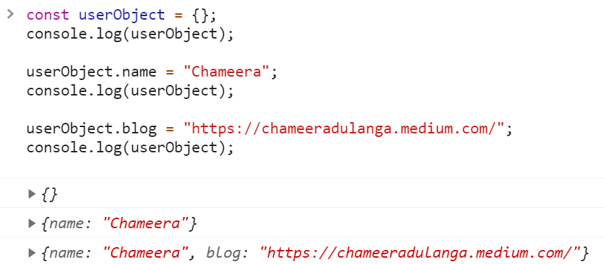

# 🔖 히든 클래스

## `📌 배운 내용 및 기억하고 싶은 내용`

우리가 자주 사용하는 크롬에서 자바스크립트 엔진을 동작시킬 때 C++로 작성된 V8 엔진을 사용한다.

### V8 작동 방식

소스코드를 파싱한후 추상구문트리로 만들면 인터프리터가 바이트코드를 생성한다.

컴파일러가 바이트코드를 가지고 데이터 캐싱 및 프로파일링을 고려하여 최적화된 기계어를 생성한다.

자바스크립트는 동적 타입 언어이므로 정적 타입 언어에 비해 객체의 프로퍼티에 접근하는 속도가 느리다.

### 히든 클래스

히든 클래스는 개체의 속성 수와 개체의 프로토타입에 대한 참조를 포함하여 개체에 대한 메타 정보를 저장한다. 

히든 클래스는 일반적인 객체 지향 프로그래밍 언어의 클래스와 개념적으로 유사하지만, 자바스크립트와 같은 프로토타입 기반 언어에서는 일반적으로 클래스를 미리 알 수 없다. 따라서 이 경우 V8의 경우 히든클래스는 즉석에서 생성되고 개체가 변경될 때 동적으로 업데이트된다.

### 히든 클래스의 특징

1. 히든클래스는 반드시 하나의 객체마다 부여된다.

2. 히든클래스는 각 프로퍼티에 대해 오프셋 정보를 가지고 있다.

3. 객체에 프로퍼티에가 추가, 수정, 삭제되면 새로운 히든클래스가 만들어지며, 이는 기존 히든클래스 정보에 추가로 업데이트된 정보를 가지고 있게 된다.

4. 3의 과정에서 원래의 히든 클래스는 참조해야되는 히든클래스 정보가 추가된다.

### 히든 클래스의 작동 방식

V8 엔진은 히든 클래스를 사용하여 마우스 포인터 실행을 최적화 한다.

새 객체를 생성할 때 V8 엔진은 새로운 히든 클래스를 생성한다. 그런 다음 새 프로퍼티를 추가해 동일한 객체를 수정하면 V8 엔진에서 이전 클래스의 모든 프로퍼티가 포함된 새 히든 클래스를 만들고 새 프로퍼티를 포함한다.

1. 빈 객체를 생성하면 V8은 상쇄되지 않고 해당 히든 클래스(C01)를 처리한다.

2. 새로운 프로퍼티를 추가해 해당 객체를 수정한다. 이제 V8 엔진은 이전 히든 클래스(C01)의 모든 프로퍼티를 상속해 새든 클래스(C02)를 생성하고 이름 프로퍼티를 0에 표시한다.

3. 프로퍼티 이름에 접근할 때 사전형 탐색(Dictionary lookups)을 할 수 있고 V8은 클래스 C01을 직접 꽃킨다. 이 객체에 다른 프로퍼티를 추가하면 이 과정이 이루어진다. 또 다른 히든 클래스가 생성되고 이전 프로퍼티와 새프로퍼티는 제외가 된다.

- `const articleObject = { }`라는 다른 빈 객체를 생성하면 V8 엔진은 새로운 히든 클래스를 생성하지 않는다. 대신 이미 생성된 C01 클래스를 가리킨다.

- V8 이라는 `articleName`이름의 프로퍼티를 추가해 `articleObject`수정하면 V8 `name`이라는 이름의 프로퍼티만 형이상학적으로 이전에 생성한 클래스(C02)를 사용할 수 없다.

- 따라서, 피부에 닿는 피부의 성능 향상을 최대화하려면 프로퍼티를 추가해야 할 수도 있습니다.

  NodeJS에서 반복문을 실행하고 있다고 가정할 때, 객체에 대해 프로퍼티를 추가하면 반복문 내부에 성능 차이가 있다. 따라서 반복문 내부에서 프로퍼티를 동적으로 추가하는 대신 반복문 외부에서 프로퍼티를 만드는 것이 좋다.

  즉, V8이 기존의 히든 클래스를 재사용할 때, 성능이 훨씬 향상된다.

---

##### 참고 사이트

https://v8.dev/blog/fast-properties

https://ui.toast.com/posts/ko_20210909