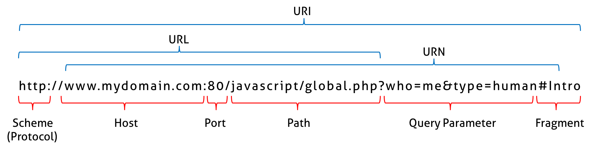
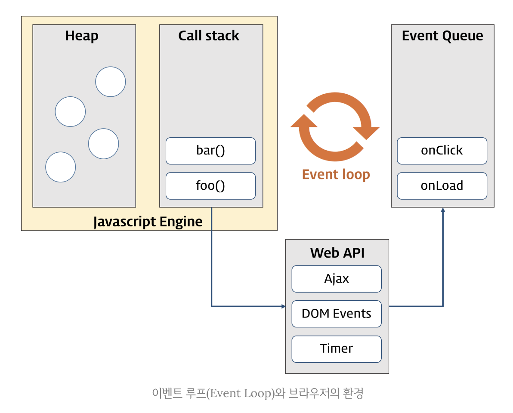

# 🔖 자바스크립트 정리(2) (22.12.24 수정)

### 파싱(parsing)

- 파싱(구문 분석)은 프로그래밍 언어의 문법에 맞게 작성된 텍스트 문서를 읽어 들여 실행하기 위해 텍스트 문서의 문자열을 토큰으로 분해(어휘분석)하고, 토큰에 문법적 의미와 구조를 반영하여 트리 구조의 자료구조인 파스 트리(parse/syntax tree)를 생성하는 일련의 과정을 말한다.
- 일반적으로 파싱이 완료된 후에는 파스트리를 기반으로 중간 언어인 바이트코드를 생성하고 실행한다.


### 렌더링(rendering)

- HTML, CSS, 자바스크립트로 작성된 문서를 파싱하여 브라우저에 시각적으로 출력하는 것을 의미한다.


### 브라우저의 렌더링 과정

1. 브라우저는 HTML, CSS, JS, 이미지, 폰트 파일 등 렌더링에 필요한 리소스를 요청하고 서버로부터 응답 받는다.
2. 브라우저의 렌더링 엔진은 서버로부터 응답된 HTML, CSS를 파싱하여 브라우저가 이해할 수 있는 자료구조인 DOM과 CSSOM을 생성하고 이들을 결합하여 렌더트리를 생성한다.
3. 브라우저의 자바스크립트 엔진은 서버로부터 응답된 자바스크립트를 파싱하여 AST(추상 구문 트리)를 생성하고 AST를 기반으로 인터프리터가 실행할 수 있는 바이트코드를 생성하여 인터프리터에 의해 실행한다. 이때 자바스크립트는 DOM API를 통해 DOM이나 CSSOM을 변경할 수 있다. 변경된 DOM과 CSSOM은 다시 렌더트리로 결합된다.
4. 렌더 트리를 기반으로 HTML 요소의 레이아웃을 계산하고 브라우저의 화면에 HTML 요소를 페인팅한다.


### 요청과 응답

- 브라우저의 핵심 기능은 필요한 리소스(HTML, CSS, 자바스크립트, 이미지, 폰트 등의 정적 파일 또는 서버가 동적으로 생성한 데이터)를 서버에 요청하고 서버로부터 응답받아 브라우저에 시각적으로 렌더링 하는 것이다.
  - 렌더링에 필요한 리소스는 모두 서버에 존재하므로 필요한 리소르를 서버에 요청하고 서버가 응답한 리소스를 파싱하여 렌더링하는 것이다.
- 서버에 요청을 하기위해 브라우저는 주소창을 제공한다. 브라우저의 주소창에 URL을 입력하고 엔터키를 누르면 URL의 호스트 이름이 DNS를 통해 IP주소로 변환되고 이 IP주소를 갖는 서버에게 요청을 전송한다.
- 
  - 브라우저에 `https://mydomain.com`을 입력하고 엔터 키를 누르면 루트요청(/, 스킴과 호스트만으로 구성된 URI에 의한 요청)이 mydomain.com 서버로 전송된다.
  - 루트 요청에는 명확히 리소스를 요청하는 내뇽이 없지만 일반적으로 서버는 루트 요청에 대해 함묵적으로 index.html을 응답하도록 기본 설정되어 있다.
    - `https://mydomain.com` ===`https://mydomain.com/index.html`
  - 서버는 루트 요청에 대해 서버의 루트 폴더에 존재하는 정적 파일 index.html을 클라이언트로 응답한다.
  - 다른 정적 파일을 서버에 요청하려면 브라우저 주소창에 `https://mydomain.com/assets/data/data.json`과 같이 요청할 정적 파일의 경로(서버의 루트 폴더 기준)와 파일 이름을 URI의 호스트 뒤에 패스에 기술에 서버에 요청한다.
  - 반드시 브라우저의 주소창을 통해 정적 파일만을 요청할 수 있는 것은 아니다.
    - 자바스크립트를 통해 동적으로 서버에 정적/동적 데이터를 요청할 수 있다.


### HTTP 1.1과 HTTP 2.0

- **HTTP(HyperText Transfer Protocol)**: 웹에서 브라우저와 서버가 통신하기 위한 프로토콜(규약)이다.
  - 1991년, 팀 버너스 리가 고안하여 최초로 문서화 되었다.
  - 1996년, HTTP/1.0, 1999년 HTTP/1.1, 2015년 HTTP/2가 발표되었다.
- HTTP 1.1과 HTTP 2.0의 차이
  - HTTP 1.1
    - 커넥션당 하나의 요청과 응답만 처리한다.
    - 여러 개의 요청을 한번에 전송할 수 없고 응답 또한 한번에 전송할 수 없다.
    - HTML 문서 내에 포함된 여러 개의 리소스 요청이 개별적으로 전송되고 응답 또한 개별적으로 전송된다.(link태그, img태그, script태그)
    - 리소스의 동시 전송이 불가능한 구조이므로 요청할 리소스의 개수에 비례하여 응답 시간도 증가하는 단점이 있다.
  - HTTP 2.0
    - 커넥션당 여러 개의 요청과 응답이 가능하다.
    - 다충 요청/응답이 가능하다.
    - 여러 리소스의 동시 전송이 가능하므로 HTTP 1.1에 비해 페이지 로드 속도가 약 50% 빠르다.


### HTML 파싱과 DOM 생성 과정

- 브라우저에 요청에 의해 서버가 응답한 HTML 문서는 문자열로 이루어진 순수한 텍스트다.
  - 브라우저에 시각적인 픽셀로 렌더링하려면 HTML 문서를 브라우저가 이해할 수 있는 자료구조(객체)로 변환하여 메모리에 저장해야 한다.

- 브라우저의 렌더링 엔진은 응답받은 HTML 문서를 파싱하여 브라우저가 이해할 수 있는 자료구조인 DOM(Document Object Model)을 생성한다.

- 바이트 → 문자 → 토큰 → 노드 → DOM

- **DOM 생성 과정**

  1. 서버에 존재하던 HTML파일이 브라우저의 요청에 의해 응답된다. 서버는 브라우저가 요청한 HTML 파일을 읽어 들여 메모리에 저장한 다음 메모리에 저장된 **바이트(2진수)**를 인터넷을 경유하여 응답한다.

  1. 브라우저는 서버가 응답한 HTML 문서를 바이트(2진수) 형태로 응답받는다. 응답된 바이트 형태의 HTML 문서는 meta태그의 charset 어트리뷰트에 선언된 인코딩 방식(UTF-8)은 content-type: text/html; charset=utf-8과 같이 응답헤더에 담겨 응답된다. 브라우저는 이를 확인하고 **문자열**로 변환한다.

  1. 문자열로 변환된 HTML 문서를 읽어들여 문법적 의미를 갖는 코드의 최소단위인 **토큰(token)**들로 분해한다.

  1. 각 토큰들을 객체로 변환하여 **노드(node)**들을 생성한다.토큰에 내용에 따라 문서노드, 요소노드, 어트리뷰트노드, 텍스트 노드가 생성된다. 노드는 이후 DOM을 구성하는 기본 요소가 된다.

  1. HTML 문서는 HTML 요소들의 집합으로 이루어지며 HTML 요소는 중첩관계를 갖는다. 즉, HTML 요소의 콘텐츠 영역에는 텍스트 뿐만 아니라 다른 HTML 요소도 포함될 수 있다. 이때 HTML 요소간에는 중첩 관계에 의해 부자 관계가 형성된다. 이러한 HTML 요소 간의 부자 관계를 반영하여 모든 노드들을 **트리 자료구조**인 **DOM(Document Object Model)**으로 구성한다.


### CSS 파싱과 CSSOM 생성

1. 렌더링 엔진은 파싱 중 CSS를 로드하는 link태그나 style태그를 만나면 DOM생성을 일시 중단한다.
2. link 태그의 href 어트리뷰트에 지정된 CSS파일을 서버에 요청하여 로드한 CSS파일이나 style 태그 내의 CSS를 HTML과 동일한 파싱 과정(바이트 → 문자 → 토큰 → 노드 → CSSOM)을 거치며 해석하여 **CSSOM(CSS Object Model)**을 생성한다. 
3. CSS 파싱을 완료하면 HTML 파싱이 중단된 시점부터 다시 HTML을 파싱하기 시작하여 DOM 생성을 재개한다.

- CSSOM은 CSS의 상속을 반영하여 생성된다.


### 렌더 트리 생성

- 렌더링 엔진은 서버로부터 응답된 HTML과 CSS를 파싱하여 DOM과 CSSOM을 생성하고 렌더링을 위해 렌더트리(render tree)로 결합된다.
- 렌더 트리는 렌더링을 위한 트리구조의 자료구조이다.
- 렌더 트리는 브라우저 화면에 렌더링되는 노드들만으로 구성된다.
  - 브라우저 화면에 렌더링 되지않는 노드(meta태그, script태그 등)와 CSS에 의해 비표시(display: none)되는 노드들은 포함하지 않는다.
- 완성된 렌더트리는 각 HTML 요소의 **레이아웃(위치와 크기)**를 계산하는데 사용되며 브라우저 화면에 픽셀을 렌더링하는 **페인팅(painting)** 처리에 입력된다.
- 반복해서 레이아웃 계산과 페인팅이 재차 실행되는 경우
  - 자바스크립트에 의한 노드 추가 또는 삭제
  - 브라우저 창의 리사이징에 의한 뷰포트 크기 변경
  - HTML 요소의 레이아웃에 변경을 발생시키는 width/height, margin, padding, border, display, position, top/right/left/bottom 등의 스타일 변경
- 레이아웃 계산과 페인팅을 다시 실행하는 리렌더링은 성능에 악영향을 주는 작업이다.
  - 가급적으로 리렌더링이 빈번하게 발생하지 않도록 주의할 필요가 있다.


### 자바스크립트 파싱과 실행

- DOM은 HTML 문서의 구조와 정보, HTML 요소와 스타일 등을 변경할 수 있는 프로그래밍 인터페이스로서 DOM API를 제공한다.
  - 자바스크립트 코드에서 DOM API를 사용하면 이미 생성된 DOM을 동적으로 조작할 수있다. 
- 자바스크립트 소스코드 → 토크나이저 → 토큰 → 파서 → AST → 바이트코드 생성기 → 바이트코드 → 인터프리터
- 토크 나이징
  - 단순한 문자열인 자바스크립트 소스코드를 어휘 분석하여 문법적 의미를 갖는 코드를 의미를 갖는 코드의 최소 단위인 토큰들로 분해한다. 이과정을 **렉싱(lexing)**이라고 부르기도 하지만 토크나이징과 미묘한 차이가 있다.
- 파싱
  - 토큰들의 집합을 구문 분석하여 AST(추상 구문 트리)를 생성한다. 
- AST(추상 구문 트리)
  - 토큰에 문법적 의미와 구조를 반영한 트리 구조의 자료구조이다.
  - 추상 구문 트리를 사용하면 TypeScript, Babel, Prettier 같은 트랜스파일러를 구현할 수 있다.
- 바이트코드 생성과 실행
  - 파싱의 결과물로 생성된 AST는 인터프리터가 실행할 수 있는 중간 코드인 바이트코드로 변환되고 인터프리터에 의해 실행된다.
    - V8엔진에서 자주 사용되는 코드는 터보팬이라고 불리는 컴파일러에의해 최적화된 머신코드(optimized machine code)로 컴파일되어 최적화한다.
    - 코드의 사용 빈도가 적다면 다시 디옵티마이징하기도 한다.
- **자바스크립트 파싱과 실행 과정**
  1. 렌더링 엔진은 DOM을 생성해 나가다가 자바스크립트 파일을 로드하는 script 태그나 자바스크립트 코드를 콘텐츠로 담은 script 태그를 만나면 DOM 생성을 일시 중단한다.
  2. script 태그의 src 어트리뷰트에 정의된 자바스크립트 파일을 서버에 요청하여 로드한 자바스크립트 파일이나 script 태그 내의 자바스크립트 코드를 파싱하기 위해 자바스크립트 엔진에 제어권을 넘긴다.
  3. 자바스크립트 코드를 파싱하기 시작하면 자바스크립트 엔진은 자바스크립트를 해석하여 **AST(Abstract Syntax Tree: 추상 구문 트리)**를 생성한다. 그리고 AST 기반으로 인터프리터가 실행할 수 있는 중간코드인 바이트코드를 생성하여 실행한다.
  4. 자바스크립트 파싱과 실행이 종료되면 렌더링 엔진에 제어권을 다시 넘겨 HTML 파싱이 중단된 시점부터 HTML 파싱을 시작하여 DOM 생성을 재개한다.

- 자바스크립트 엔진은 자바스크립트 코드를 파싱하여 CPU가 이해할 수 있는 저수준 언어로 변환하고 실행하는 역할을 한다.
- 모든 자바스크립트 엔진은 ECMAScript 사양을 준수한다.


### 리플로우와 리페인트

- 자바스크립트 코드에 DOM이나 CSSOM을 변경하는 DOM API가 사용된 경우 DOM이나 CSSOM이 변경된다.
- 변경된 DOM과 CSSOM은 다시 렌더 트리로 결합되고 변경된 렌더 트리를 기반으로 레이아웃과 페인팅 과정을 거쳐 브라우저 화면에 다시 렌더링한다. 이것을 **리플로우(reflow)**,  **리페인트(repaint)**라고 한다.
- 리플로우: 레이아웃을 다신 계산하는 것을 의미한다.
  - 노드 추가/삭제, 요소의 크기/위치 변경, 윈도우 리사이징 등 레이아웃에 영향을 주는 변경이 발생한 경우에 한하여 실행된다.
- 리페인트: 재결합된 렌더 트리를 기반으로 다시 페인트 하는 것을 의미한다.
- 레이아웃에 영향이 없는 변경은 리플로우 없이 리페인트만 실행된다.


### 자바스크립트 파싱에 의한 HTML 파싱 중단

- 렌더링 엔진과 자바스크립트 엔진은 병령적으로 파싱을 실행하지 않고 직렬적으로 파싱을 수행한다.

- 브라우저는 동기적(synchronous)으로 파싱하고 실행한다.

  - script 태그의 위치에 따라 HTML 파싱이 블로킹되어 DOM 생성이 지연될 수 있다.
  - script 태그의 위치는 중요하다.

- body 요소의 가장 아래에 자바스크립트를 위치시키는 것을 권장한다.

  1. DOM을 변경하는 DOM API를 사용할 때 DOM의 생성이 완료되지 않은 상태라면 문제가 발생할 수 있다.
  2. 자바스크립트 로딩/파싱/실행으로 인해 HTML 요소들의 렌더링에 지방받는 일이 발생하지 않아 페이지 로딩 시간이 단축된다.

  

### async / defer 어트리뷰트

- DOM 생성이 중단되는 문제를 근본적으로 해결하기 위해 HTML5부터 script 태그에 async, defer 어트리뷰트가 추가되었다.
- async, defer 어트리뷰트는 src 어트리뷰트가 없는 인라인 자바스크립트에는 사용할 수 없다.
- async, defer 어트리뷰트를 사용하면 HTML 파싱과 외부 자바스크립트 파일의 로드가 **비동기적(asynchronous)**으로 동시에 실행된다.
- **async 어트리뷰트**
  - HTML 파싱과 외부 자바스크립트 파일의 로드가 비동기적으로 동시에 진행된다.
  - 자바스크립트의 파싱과 실행은 자바스크립트 파일의 로드가 완료된 직후 진행되며 HTML 파싱이 중단된다.
  - 순서가 보장되지 않는다.
- **defer 어트리뷰트**
  - HTML 파싱과 외부 자바스크립트 파일의 로드가 비동기적으로 동시에 진행된다.
  - 자바스크립트의 파싱과 실행은 HTML 파싱이 완료된 직후(DOM 생성이 완료된 직후: DOMContentLoaded 이벤트가 발생된다.) 진행된다.
  - DOM 생성이 완료된 이후 실행되어야 할 자바스크립트에 유용하다.


### DOM(Document Object Model)

- HTML 문서의 계층적 구조와 정보를 표현하며 이를 제어할 수 있는 API(프로퍼티와 메서드)를 제공하는 자료구조이다.
- 노드 객체들로 구성된 트리 자료구조를 의미한다.


### 트리 자료구조

- 부모 노드와 자식 노드로 구성되어 노드 간의 계층적 구조(부자, 형제 관계)를 표현하는 비선형 자료구조를 의미한다.
- 루트 노드: 최상위 노드, 트리를 시작하는 노드이며 부모노드가 없다. 0개 이상의 자식노드를 갖는다.
- 리프 노드: 자식 노드가 없는 노드


### 2진 트리

- 2개의 자식 노드를 갖는 트리


### 비선형 자료구조

- 하나의 자료 뒤에 여러 개의 자료가 존재할 수 있는 자료구조이다.

- 트리와 그래프가 있다.


### 선형 자료구조

- 하나의 자료 뒤에 하나의 자료만 존재하는 자료구조다.
- 배열, 스택, 큐, 링크드 리스트, 해시 테이블이 있다.


### 중요한 4개의 노드 타입

#### 문서 노드

- DOM트리 최상위에 존재하는 루트노드로서 document 객체를 가리킨다.
- 브라우저 환경의 모든 자바스크립트 노드는 script 태그에 의해 분리되어 있어도 하나의 전역 객체 windw를 공유한다.
- DOM 트리의 노드들에 접근하기 위한 진입점 역할을 담당한다.


#### 요소 노드

- HTML 요소를 가리키는 객체다.
- HTML 요소간의 중첩에 의해 부자관계를 가지며 정보를 구조화한다.
- 문서의 구조를 표현한다.


#### 어트리뷰트 노드

- HTML 요소의 어트리뷰트를 가리키는 객체다.
- 어트리뷰트가 지정된 HTML 요소의 요소노드와 연결되어 있다.
- 요소 노드의 형제 노드는 아니다.


#### 텍스트 노드

- HTML 요소의 텍스트를 가리키는 객체다.
- 문서의 정보를 표현한다.
- 리프 노드이다.


### 노드 객체의 상속 구조

- 모든 노드 객체는 Object, EventTarget, Node 인터페이스를 상속받는다.
- 문서 노드는 Document, HTMLDocument 인터페이스를 상속받는다.
- 어트리뷰트 노드는 Attr 인터페이스를 상속받는다.
- 텍스트 노드는 CharacterData 인터페이스를 상속받는다.
- 요소 노드는 Element 인터페이스를 상속받는다.
  - HTMLElement, HTMLhtmlElement, HTMLHeadElement, HTMLBodyElement, HTMLUListElment 등의 인터페이스도 추가로 상속받는다.

- 프로토타입 체인이 발생한다.

- 노드 객체는 노트 타입에 상관없이 모든 노드 객체가 공통으로 갖는 기능도 있고, 고유한 기능도 있다.
  - 예를 들어 모든 노드 객체는 공통적으로 이벤트를 발생시킬 수 있다.
  - 모든 노드 객체는 공통적으로 트리 탐색 기능과 노드 정보 제공 기능이 필요하다. 노드관련 기능은 Node 인터페이스가 제공한다.
- 노드 객체는 공통된 기능일수록 프로토타입 체인의 상위에, 개별적인 고유 기능일수록 프로토타입 체인 하위에 프로토타입 체인을 구축하여 노드객체에 필요한 기능(프로퍼티와 메서드)을 제공하는 상속 구조를 갖는다.


### HTMLCollection 객체

- 유사 배열 객체이면서 이터러블이다.
- DOM API가 여러 개의 결과값을 반환하기 위한 DOM 컬렉션 객체이다.
- 노드 객체의 상태 변화를 실시간으로 반영하는 살아있는 객체이다.
- getElementsByTagName, getElementsByClassName 메서드
- 실시간으로 노드 객체의 상태 변경을 반영하여 요소를 제거할 수 있어 for문으로 순회하면서 노드 객체의 상태를 변경해야 할 때 주의해야한다.
  - 역방향으로 순회하거나 while문, 배열의 고차함수를 이용하며 HTMLCollection 객체를 사용하지 않는 것을 권한다.
  - 배열로 변환하여 사용하는 것을 권한다.(스프레드 문법, Array.from 메서드)


### NodeList 객체

- 유사 배열 객체이면서 이터러블이다.
- DOM API가 여러 개의 결과값을 반환하기 위한 DOM 컬렉션 객체이다.

- 일부분은 노드 객체의 상태 변화를 실시간으로 반영하는 살아있는 객체이다.
  - childNodes 프로퍼티가 반환하는 NodeList 객체이다.
  - 배열로 변환하여 사용하는 것을 권한다.(스프레드 문법, Array.from 메서드)
- 대부분은 과거의 정적 상태를 유지하는 non-live 객체로 동작한다.
  - 실시간으로 노드 객체의 상태 변경을 반영하지 않는 객체다.
- HTMLCollection의 부작용을 해결하기 위해 querySelectorAll 메서드를 사용한다.


### 공백 텍스트 노드

- HTML 요소 사이의 스페이스, 탭, 줄바꿈(개행) 등의 공백문자는 텍스트 노드를 생성한다.


### textContent와 innerHTML의 차이

- textContent 프로퍼티: 텍스트를 모두 반환한다.  HTML 마크업은 무시된다.

- innerHTML 프로퍼티: 콘텐츠 영역에 포함된 모든 HTML 마크업이 포함된 문자열을 반환한다.
  - 장점
    - 구현이 간단하고 직관적이다.
  - 단점
    - 크로스 사이트 스크립팅 공격(XSS)에 취약하므로 위험하다.
    - 기존 식 노드까지 모두 제거하고 다시 처음부터 새롭게 자식 노드를 생성하여 DOM에 반영하기 때문에 비효율적이다.
    - 새로운 요소를 삽입할 때 삽입될 위치를 지정할 수 없다.


### 크로스 사이트 스크립팅 공격(Cross Site Scripting, XSS)

- 공격자가 상대방의 브라우저에 스크립트가 실행되도록 해 사용자의 세션을 가로채거나, 웹사이트를 변조하거나, 악의적 콘텐츠를 삽입하거나, 피싱 공격을 진행하는 것을 의미한다.
- XSS 공격은 스크립트 언어와 취약한 코드를 공격 대상으로 한다.


### HTML 새니티제이션

- 사용자로부터 입력받은 데이터에 의해 발생할 수 있는 크로스 사이트 스크립팅 공격을 예방하기 위해 잠재적 위험을 제거하는 기능을 의미한다.
- 직접 구현할 수 있지만 DOMPurify 라이브러리를 사용하는 것을 권장한다.
- 살균이라는 의미가 내포되어있다.


### HTML 어트리뷰트와 DOM프로퍼티 차이

- HTML 어트리뷰트:  요소 노드의 초기 상태를 관리한다.
  - 어트리뷰트 이름은 대소문자를 구별하지 않는다.
- DOM 프로퍼티 : 요소노드의 최신 상태를 관리한다.
  - 프로퍼티 키는 카멜케이스에 따른다.


#### 이벤트 핸들러

- 이벤트가 발생했을 때 호출될 함수다.

- 이벤트 핸들러 등록: 이벤트가 발생했을 때 브라우저에게 이벤트 핸들러의 호출을 위임하는 것이다.


### 이벤트 드리븐 프로그래밍

- 프로그램의 흐름을 이벤트 중심으로 제어하는 프로그래밍 방식
- 이벤트와 이벤트 핸들러를 통해 사용자와 애플리케이션은 상호작용을 할 수 있다.


### 이벤트 핸들러 프로퍼티 방식

- on 접두사가 필요하다.

- 장점
  - HTML와 자바스크립트가 뒤섞이는 문제를 해결할 수 있다.

- 단점
  - 이벤트 핸들러 프로퍼티에 하나의 이벤트 핸들러만 바인딩할 수 있다.


### addEventListener 메서드 방식

- on 접두사를 붙이지 않는다.
- 매개변수
  - 첫번째: 이벤트 타입
  - 두번째: 이벤트 핸들러
  - 세번째: 이벤트를 캐치할 이벤트 전파 단계
- 장점
  - 하나 이상의 이벤트 핸들러를 등록할 수 있다.
    - 이벤트 핸들러는 등록된 순서대로 호출된다.


### 이벤트 객체

- 이벤트가 발생하면 이벤트와 관련한 다양한 정보를 담고 있는 이벤트 객체가 동적으로 생성된다.
- 생성된 이벤트 객체는 이벤트 핸들러의 첫번째 인수로 전달된다.
  - 이벤트 객체를 전달받으려면 이벤트 핸들러를 정의할 때 이벤트 객체를 전달받을 매개변수를 명시적으로 선언해야한다.
  - 매개변수 이름을 다른이름으로 해도 상관없다.
- ex) `e`, `event`


### target과 currentTarget의 차이점

- target 프로퍼티: 이벤트를 발생시킨 DOM 요소

- currentTarget 프로퍼티: 이벤트 핸들러가 바인딩된 DOM 요소

일반적으로 target 프로퍼티와 currentTarget 프로퍼티는 동일한 DOM 요소를 가리키지만, 이벤트 위임에서는 서로 다른 DOM 요소를 가리킬 수 있다.


### transform프로퍼티의 translate3d 메서드

- GPU 가속을 사용하여 GPU 메모리에서 관련 작업을 진행해 매우 빠르다. 
- 관련 작업의 레이아웃, 페인트 작업이 없어지게 된다. 반복적인 레이아웃, 페인트 단계가 없어지므로 성능이 좋다.


### 이벤트 전파 

- DOM 트리 상에 존재하는 DOM 요소 노드에서 발생한 이벤트는 DOM 트리를 통해 전파되는 것을 의미한다.
- 생성된 이벤트 객체는 이벤트 타깃을 중심으로 DOM 트리를 통해 전파된다.


### 이벤트 전파 3단계

- 캡처링 단계: 이벤트가 상위요소에서 하위요소로 전파
- 타깃 단계: 이벤트가 이벤트 타깃에 도달
- 버블링 단계: 이벤트가 하위요소에서 상위요소 방향으로 전파

- 이벤트 핸들러 어트리뷰트/프로퍼티 방식으로 등록한 이벤트 핸들러는 타깃 단계와 버블링 단계의 이벤트만 캐치할 수 있다.
- addEventListener 메서드 방식으로 등록한 이벤트 핸들러 타깃 단계, 버블링 단계 뿐만 아니라 캡처링 단계도 선별적으로 캐치할 수 있다.
  - 세번째 인수 true일 시 캡처링 단계를 캐치할 수 있다. false인 경우 타깃 단계와 버블링 단계의 이벤트만 캐치할 수 있다.
- 이벤트는 이벤트를 발생시킨 이벤트 타깃은 물론 상위 DOM 요소에서도 캐치할 수 있다.


### 이벤트 위임

- 여러 개의 하위 DOM 요소에 각각 이벤트 핸들러를 등록하는 대신 하나의 상위 DOM요소에 이벤트 핸들러를 등록하는 방법을 의미한다.
  - 이벤트 위임을 통해 상위 DOM요소에 이벤트 핸들러를 등록하면 여러 개의 하위 DOM 요소에 이벤트 핸들러를 등록할 필요가 없다.


### preventDefault 메서드

- DOM 요소의 기본 동작을 중단시킨다.


### stopPropagation 메서드

- 이벤트 전파를 중지시킨다.
- 하위 DOM 요소의 이벤트를 개별적으로 처리하기 위해 이벤트의 전파를 중단시킨다.


### 이벤트 핸들러 내부의 this

- 이벤트 핸들러 어트리뷰트 방식
  - 이벤트 핸들러 내부의 this는 전역객체 window를 가리킨다.
  - 이벤트 핸들러를 호출할 때, 인수로 전달한 this는 이벤트를 바인딩한 DOM요소를 가르킨다.
- 이벤트 핸들러 프로퍼티 방식과 addEventListener 메서드 방식
  - 이벤트 핸들러 내부의 this는 이벤트를 바인딩한 DOM요소를 가르킨다.
    - 이벤트 핸들러 내부의 this는 이벤트 객체의 currentTarget 프로퍼티와 같다.
  - 화살표 함수로 정의한 이벤트 핸들러 내부의 this는 상위 스코프의 this를 가리킨다.


### 커스텀 이벤트

- 개발자의 의도로 생성된 이벤트를 의미한다.


### 커스텀 이벤트 디스패치

- dispatchEvent 메서드로 디스패치할 수 있다.
- 디스패치(dispatch): 이벤트를 발생시키는 행위

- 일반적으로 이벤트 핸들러는 비동기 처리 방식으로 동작하지만, dispatchEvent 메서드는 이벤트 핸들러를 동기 처리 방식으로 호출한다.

  - dispatchEvent 메서드를 호출하면 커스텀 이벤트에 바인딩된 이벤트 핸들러를 직접 호출하는 것과 같다.

  - 따라서 dispatchEvent 메서드로 이벤트를 디스패치하기 이전에 커스텀 이벤트를 처리할 이벤트 핸들러를 등록해야 한다.

- 기존 이벤트 타입이 아닌 임의의 이벤트 타입을 지정하여 커스텀 이벤트 객체를 생성한 경우 반드시 addEventListener 메서드 방식으로 이벤트 핸들러를 등록해야 한다.


### 호출 스케줄링

- 함수를 명시적으로 호출하지 않고 일정 시간이 경과한 이후에 호출되도록 함수 호출을 예약하기위해 타이머 함수를 사용하는 것이다.

- 타이머 생성 메서드

  - setTimeout: 콜백 함수는 타이머가 만료되면 단 한 번만 호출된다.

    - ```javascript
      const timeId = setTimeout(name => console.log(`Hi! ${name}.`), 1000, 'Yoo')
      clearTimeout(timeId);
      ```

    - 생성된 타이머를 식별할 수 있는 고유한 타이머 id를 반환한다.

  - setInterval: 콜백 함수는 타이머가 만료될 때마다 반복 호출된다.

    - ```javascript
      const count = 1;
      const timeoutId = setInterval(() => {
        console.log(count);
        if (count++ === 5) clearInterval(timeoutId)
      }, 1000)
      ```

    - 생성된 타이머를 식별할 수 있는 고유한 타이머 id를 반환한다.

  - 공통점: 생성한 타이머가 만료되면 콜백 함수가 호출된다.

- 타이머 제거 메서드

  - clearTimeout: setTimeout 함수로 사용한 타이머를 취소한다.
    - 함수가 반환한 타이머 id를 인수로 전달하여 타이머를 취소한다.
  - clearInterval: setInterval 함수로 사용한 타이머를 취소한다.
    - 함수가 반환한 타이머 id를 인수로 전달하여 타이머를 취소한다.

- 타이머 함수는 호스트 객체이다.

- 자바스크립트 엔진은 싱글 스레드로 동작하기 때문에 타이머 함수는 비동기 처리 방식으로 동작한다.


### 디바운스

- 짧은 시간 간격으로 이벤트가 연속해서 발생하면 이벤트 핸들러를 호출하지 않다가 일정 시간이 경과한 이후 이벤트 핸들러가 한 번만 호출되도록한다.
  - 짧은 시간 간격으로 발생하는 이벤트를 그룹화해서 마지막에 한 번만 이벤트 핸들러가 호출되도록 한다.
- 예시) resize 이벤트 처리, input 요소에 입력된 값으로 ajax 요청하는 입력 필드 자동완성 UI 구현, 버튼 중복 클릭 방지 등
- 실무에서는 Underscore의 debounce 함수나 Lodash의 debounce 함수를 사용하는 것을 권장한다.


### 스로틀

- 짧은 시간 간격으로 이벤트가 연속해서 발생하더라도 일정 시간 간격으로 이벤트 핸들러가 최대 한 번만되도록 한다.
  - 짧은 시간 간격으로 연속해서 발생하는 이벤트를 그룹화해서 일정 시간 단위로 이벤트 핸들러가 호출되도록 이벤트 주기를 만든다.

- 예시) scroll 이벤트 처리, 무한 스크롤 UI 구현
- 실무에서는 Underscore의 throttle 함수나 Lodash의 throttle 함수를 사용하는 것을 권장한다.


### 동기 처리(synchronous)

- 현재 실행 중인 태스크가 종료할 때까지 다음에 실행될 태스크가 대기하는 방식이다.
- 장점
  - 실행 순서가 보장된다.
- 단점
  - 앞선 태스크가 종료할 때까지 이후 태스크들이 블로킹(작업 중지)된다.


### 비동기 처리(asynchronous)

- 현재 실행 중인 태스크가 종료되지 않은 상태라 해도 다음 태스크를 곧바로 실행하는 방식이다.
- 장점
  - 블로킹이 발생하지 않는다.
- 단점
  - 실행 순서가 보장되지 않는다.
- 콜백 패턴을 사용한다.
  - 콜백 헬을 발생시켜 가독성을 나쁘게한다.
  - 비동기 처리 중 발생한 에러의 예외 처리가 곤란하다.
  - 여러 개의 비동기 처리를 한번에 처리하는데 한계가 있다.
- 타이머 함수, HTTP 요청, 이벤트 핸들러는 비동기 처리 방식으로 동작한다.


### 이벤트 루프

- 자바스크립트의 동시성을 지원하는 것을 의미한다.
- 브라우저에 내장되어 있는 기능 중 하나다.


### 자바스크립트의 동작 원리(이벤트 루프)



- 일반적인 작업은 Call Stack에서 진행한다.
- 시간이 소요되는 작업(setTimeout, Event, HTTP 요청 메서드)들은 Web API 대기 후에 Callback Queue로 보내진다.

- Call Stack이 비워있을 때만 Callback Queue에 저장된 작업들을 Call Stack으로 보낸다.

> ##### 콜 스택 - 자바스크립트 엔진
>
> 실행 컨텍스트 스택을 의미한다.
>
> LIFO(Last-In-First-Out) 구조이다. 즉, 동기 처리 방식으로 동작한다.
>
> ##### 힙  - 자바스크립트 엔진
>
> 객체가 저장되는 메모리 공간이다.
>
> 구조화가 되어있지 않다.
>
> ##### 태스크 큐  - 브라우저
>
> 비동기 함수의 콜백 함수 또는 이벤트 핸들러가 일시적으로 보관되는 영역이다.
>
> ##### 마이크로 큐 - 브라우저
>
> 태스크 큐와 별도로 프로미스의 후속 처리 메서드의 콜백 함수가 일시적으로 보관되는 영역이다.
>
> ##### 이벤트 루프 - 브라우저
>
> 콜스택에 현재 실행 중인 실행 컨텍스트가 있는 지, 태스크 큐에 대기 중인 함수가 있는지 반복적으로 확인하는 것을 의미한다.
>
> 콜 스택이 비어있고 태스크 큐에 대기 중인 함수가 있다면 이벤트 루프는 FIFO(First-In-First-Out)으로 태스크 큐에 대기 중인 함수를 콜스택으로 이동시킨다. 즉, 비동기 처리 방식으로 동작한다.

- 자바스크립트 엔진은 싱글 스레드로 동작하지만 브라우저는 멀티 스레드로 동작한다.


### Ajax(Asynchronous Javascript and XML)

- 자바스크립트를 사용하여 브라우저가 서버에게 비동기 방식으로 데이터를 요청하고, 서버가 응답한 데이터를 수신하여 웹페이지를 동적으로 갱신하는 프로그래밍 방식을 의미한다.
- Ajax는 브라우저에서 제공하는 Web API인 XMLHttpRequest 객체를 기반으로 동작한다.
  - XMLHttpRequest는 HTTP 비동기 통신을 위한 메서드와 프로퍼티를 제공한다.
- 장점
  - 변경할 부분을 갱신하는데 필요한 데이터만 서버로부터 전송받아 불필요한 데이터 통신이 발생하지 않는다.
  - 변경할 필요가 없는 부분은 다시 렌더링하지 않는다. 
    - 화면이 순간적으로 깜박이는 현상이 발생하지 않는다.
  - 클라이언트와 서버의 통신이 비동기 방식으로 동작하기 때문에 서버에게 요청을 보낸 이후 블로킹이 발생하지 않는다.


### JSON(JavaScript Object Notation)

- 클라이언트와 서버 간의 HTTP 통신을 위한 텍스트 데이터 포맷이다.
  - 자바스크립트에 종속되지 않은 언어 독립형 데이터 포맷으로, 대부분 프로그래밍 언어에서 사용할 수 있다.
- JSON 표기 방식
  - 자바스크립트 객체 리터럴과 유사하게 키와 값으로 구성된 순수한 텍스트다.
  - JSON의 키는 반드시 큰따옴표로 묶어야한다.


### JSON.stringify 메서드

- 객체를 JSON 포맷의 문자열로 변환한다.
- 직렬화(serializing): 클라이언트에서 서버로 객체를 전송하기 위해 객체를 문자열화 하는 것을 의미한다.
- 객체 뿐만 아니라 배열도 JSON 포맷의 문자열로 변환한다.


### JSON.parse 메서드

- JSON 포맷의 문자열을 객체로 변환한다.
- 역직열화(deserializing): 서버로부터 클라이언트에게 전송된 문자열을 객체화 하는 것을 의미한다.

- 배열이 JSON 포맷의 문자열로 변환되어 있는 경우 JSON.parse는 문자열을 배열 객체로 변환한다.
  - 배열의 요소가 객체인 경우 배열의 요소까지 객체로 변환한다.


###  XMLHttpRequest

- Web API인  XMLHttpRequest 객체는 HTTP 요청 전송과 HTTP 응답 수신을 위한 다양한 메서드와 프로퍼티를 제공한다.

 

### XMLHttpRequest 객체의 중요한 프로토타입 프로퍼티

- readyState: HTTP 요청의 현재 상태를 나타내는 정수이다.
  - UNSENT: 0
  - OPENED: 1
  - HEADERS_RECEIVED: 2
  - LODING: 3
  - DONE: 4
- status: HTTP 요청에 대한 응답 상태(HTTP 상태 코드)를 나타내는 정수
  - 예) 200
- statusText: HTTP 요청에 대한 응답 메시지를 나타내는 문자열
  - 예) "OK"
- responeseType: HTTP 응답 타입
  - 예) document, json, text, blob, arraybuffer
- responese: HTTP 요청에 대한 응답 몸체(responese body). responeseType에 따라 타입이 다르다.


### XMLHttpRequest 객체의 중요한 이벤트 핸들러 프로퍼티

- onreadystatechange: readyState프로퍼티 값이 변경된 경우
- onerror: HTTP 요청에 에러가 발생한 경우
- onload: HTTP 요청이 성공적으로 완료한 경우


### XMLHttpRequest 객체의 중요한 메서드

- open: HTTP 요청 초기화
- send: HTTP 요청 전송
- abort: 이미 전송된 HTTP 요청 중단
- setRequestHeader: 특정 HTTP 요청 헤더의 값을 설정


### XMLHttpRequest 객체의 중요한 정적 프로퍼티

- DONE(value: 4): 서버 응답 완료


### HTTP 요청 전송

- HTTP 요청을 전송하는 경우 다음 순서를 따른다.
  1. XMLHttpRequest.prototype.open 메서드로 HTTP 요청을 초기화 한다.
  2. 필요에 따라 XMLHttpRequest.prototype.setRequestHeader 메서드로 특정 HTTP 요청의 헤더 값을 설정한다.
  3. XMLHttpRequest.prototype.send 메서드로 HTTP 요청을 전송한다.

- ```js
  const xhr = new XMLHttpRequest();
  
  xhr.open('GET','/users');
  
  // 클라이언트가 서버로 전송할 데이터의 MIME 타입 지정: json
  xhr.setRequestHeader('content-type','application/json');
  
  xhr.send();
  ```

  

### XMLHttpRequest.prototype.open

- open 메서드는 서버에 전송할 HTTP 요청을 초기화한다.

- ```js
  xhr.open(method, url[, async])
  ```

- 매개변수

  - method: HTTP 요청 메서드
  - url: HTTP 요청을 전송할 URL
  - async: 비동기 요청 여부. 옵션으로 기본값은 true이다.


### HTTP 요청 메서드

- 클라이언트가 서버에게 요청의 종류와 목적(리소스에 대한 행위)을 알리는 방법이다.

- 주로 5가지 요청 메서드를 사용하여 CRUD를 구현한다.

- | HTTP 요청 메서드 | 종류           | 목적                      | 페이로드 |
  | ---------------- | -------------- | ------------------------- | :------: |
  | GET              | index/retrieve | 모든/특정 리소스 **취득** |    X     |
  | POST             | create         | 리소스 **생성**           |    O     |
  | PUT              | put            | 리소스의 **전체 교체**    |    O     |
  | PATCH            | patch          | 리소스 **일부 수정**      |    O     |
  | DELETE           | delete         | 모든/특정 리소스 **삭제** |    X     |


### XMLHttpRequest.prototype.send

- send 메서드는 open 메서드를 초기화된 HTTP 요청을 서버에 전송한다.

- 서버로 전송하는 데이터는 요청 메서드에 따라 전송 방식에 차이가 있다.

  - GET 요청 메서드: 데이터를 URL의 일부분인 쿼리 문자열로 서버에 전송한다.
  - POST 요청 메서드: 데이터(페이로드)를 요청 몸체에 담아 전송한다.

- 페이로드가 객체인 경우 반드시 JSON.stringify 메서드를 사용하여 직렬화한 다음 전달해야한다.

  - ```js
    xhr.send(JSON.stringify({id: 1, content: 'HTML', completed: false}));
    ```

- HTTP 요청 메서드가 GET인 경우 send 메서드에서 페이로드로 전달한 인수는 무시되고 요청 몸체는 null로 설정된다.


### XMLHttpRequest.prototype.setRequestHeader

- 특정 HTTP 요청의 헤더 값을 설정한다.
- **setRequestHeader 메서드는 반드시 open 메서드를 호출한 이후에 호출해야 한다.**
- content-type: 요청 몸체에 담아 전송할 데이터의 MIME 타입의 정보를 표현한다.
- MIME 타입
  - MIME 타입이란 클라이언트에게 전송된 문서의 다양성을 알려주기 위한 메커니즘이다.
  -  웹에서 파일의 확장자는 별 의미가 없으므로 각 문서와 함께 올바른 MIME 타입을 전송하도록, 서버가 정확히 설정하는 것이 중요하다. 
  - 브라우저들은 리소스를 내려받았을 때 해야 할 기본 동작이 무엇인지를 결정하기 위해 MIME 타입을 사용한다.
- 자주 사용되는 MIME 타입
  - text: text/plain, text/html, text/css, text/javascript
  - application: application/json, application/x-www-form-urlencode
  - multipart: multipart/formed-data
- HTTP 클라이언트가 서버에 요청할 때 서버가 응답할 데이터의 MIME 타입을 Accept로 지정할 수 있다.
  - Accept 헤더를 설정하지 않으면 send 메서드가 호출될 때 Accept 헤더가 `*/*`으로 전송된다.

- ```js
  // 서버가 응답할 데이터의 MIME 타입 지정: json
  xhr.setRequestHeader('accept','application/json');
  ```


---

### REST API

- REST 기반으로 서비스 API를 구현하는 것

  - **REST**: 자원을 이름으로 구분하여 해당 자원의 상태를 주고 받는 모든 것을 의미한다.

  - HTTP URI를 통해 자원을 명시하고 HTTP 메서드를 통해 해당 자원에 대한 CRUD를 적용한다.

    - 즉, 자원 기반의 구조 설계의 중심에 자원이 있고, HTTP 메서드를 통해 이를 처리한다.

  - > ##### API(Application Programming Interface)
    >
    > 응용프로그램에서 사용할 수 있도록 운영 체제나 프로그래밍 언어가 제공하는 기능을 제어할 수 있게 만든 인터페이스이다.
    >
    > - 즉, 프로그램끼리 통신할 수 있도록 하는 중재자이다.
    >
    > 
    >
    > ##### Interface
    >
    > 쉽게 말해 기본설계도를 의미한다. 즉 밑그림과 같다.
    >
    > - 추상 메서드와 상수만이 프로퍼티로 가능하다.
    >
    > - 표준, 약속, 규칙을 의미한다.
    >
    > 
    >
    > ##### 추상화
    >
    > 공통 프로퍼티와 메서드를 뽑아내는 작업을 의미한다.
    >
    > - 복잡한 자료, 모듈, 시스템으로부터 핵심적인 개념 또는 기능을 간추려 내는 것을 의미한다.
    > - 장점: **코드 중복**을 방지할 수 있고 **재사용**을 할 수 있다.
    > - 캡슐화와 정보은닉에 이용된다.
    >
    > 
    >
    > ##### 캡슐화
    >
    > 프로퍼티와 메서드를 묶는 작업을 의미한다.
    >
    > - 중요데이터에 접근하지 못하게 하기 위해 사용한다.
    > - #을 사용하여 private로 가능하다.

- REST API의 특징

  - REST API는 HTTP 표준을 기반으로 구현된다.
  - REST 기반으로 시스템을 분산시켜 확장성, 재사용성을 높여 유지보수와 운용을 쉽게 할 수 있게 만들어준다.


### Restful API

- REST 기반으로 서비스 API를 구현한 것을 의미한다.
- Rest API를 제공하는 웹서비스를 Restful 하다고 할 수 있다.
- 구성
  - 자원, 행위, 표현의 3가지 요소로 구성된다.
    - 자원: URI
    - 행위: HTTP 요청 메서드
    - 표현: 페이로드
- **HTTP API 설계원칙**
  1. **URI**는 리소스를 표현해야한다.
  2. 리소스에 대한 행위는 **HTTP 요청 메서드**로 표현한다.


### 자바스크립트의 비동기 코딩

자바스크립트 엔진은 싱글 스레드 방식으로 동작한다.

> ##### 싱글 스레드
>
> 한 번에 하나의 태스크만 실행할 수 있는 것을 의미한다.
>
> ##### 동기처리
>
> 현재 실행 중인 태스크가 종료할 때까지 다음에 실행될 태스크가 대기하는 방식을 의미한다.
>
> 장점: 실행순서가 보장된다.
>
> 단점: 앞의 태스크가 종료할 때까지 이후 태스크들이 블로킹된다.
>
> ##### 비동기처리
>
> 현재 실행 중인 태스크가 종료되지 않은 상태라 해도 다음 태스크를 곧바로 실행하는 방식을 의미한다.
>
> 장점: 블로킹이 발생하지 않는다.
>
> 단점: 태스크의 실행순서가 보장되지 않는다.
>
> 비동기 함수: 콜백 패턴을 사용한다.
>
> 비동기 처리 방식: 타이머 함수, HTTP 요청, 이벤트 핸들러

- Proimise
  - ES6에서 도입되어 전통적인 콜백 패턴이 가진 단점을 보완하며 비동기 처리시점을 명확히 표현할 수 있다.
  - .than 메서드는 promise가 처리될때 까지 대기한다.//

- 콜백함수
  - 콜백헬이 발동할 수 있다.
    - 가독성이 나빠지고 비동기 처리중 발생한 에러의 예외처리가 곤란하며, 여러 개의 비동기 처리를 한번에 처리하는 데 한계가 있다.
- async / await
  - 프로미스의 후속 처리 메서드 없이 마치 동기처리처럼 프로미스가 처리결과를 반환하도록 구현할 수 있다.
  - async: 해당함수는 항상 promise를 반환한다.
  - await: promise가 처리될때 까지 대기한다.


