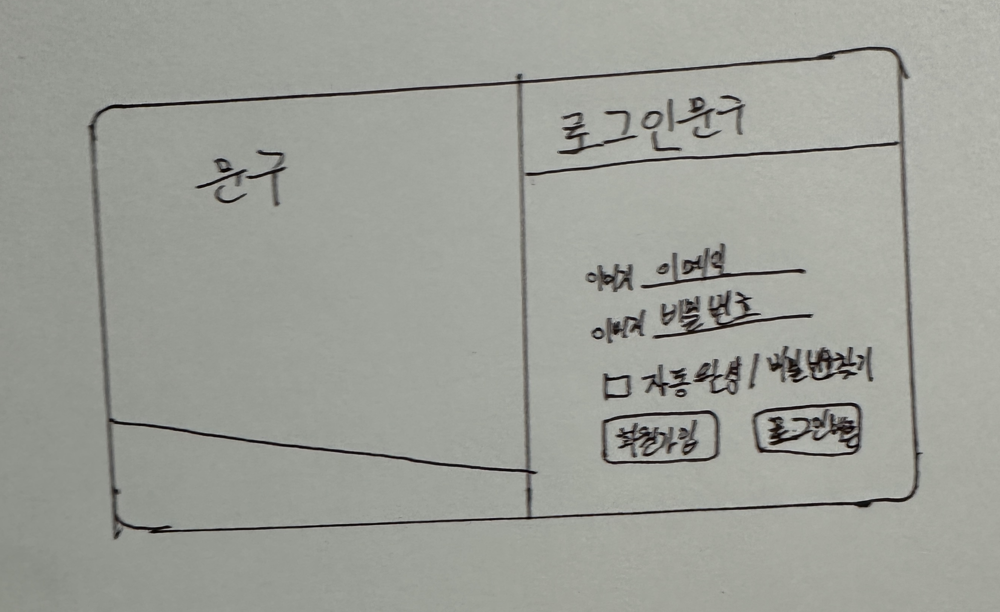
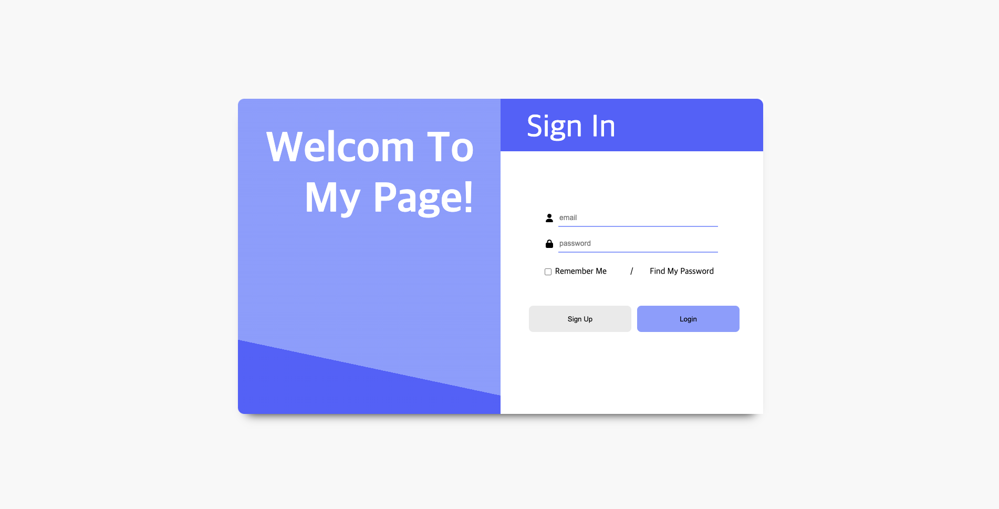

# 🖥️ 로그인 화면 구현하기(1)

## `✏️ 이런 저런 이야기`

토이프로젝트를 만들면 좋겠다고 생각하여 어떤 토이프로젝트를 만들지 고민하다가 로그인 화면을 구현을 생각하고 디자인을 생각하였다.

일단 로그인이 될려면 아이디와 패스워드 입력칸, 버튼이 있어야 한다. 기본적인 기능을 생각하고 자동완성 기능과 비밀번호 찾기 사이트텍스트링크, 회원가입 버튼을 추가하기로 생각했다.



디자인은 이런식으로 구성하였다. 그런다음 초기 세팅을 하기로 했다.

---

### 초기세팅

자바스크립트로 몇 번 구현해 본 경험이 있기 때문에, 이번에는 타입스크립트로 구현해보기로 했다. 평소에 자주쓰던 vscode 에디터를 선택하였고 라이브러리는 React를 사용하였다.

일단 시작을 하기전에 이 토이프로젝트를 할 파일을 생성한후, 다음 명령어를 사용해 React와 TypeScript를 설치하였다.

```bash
$ npx create-react-app toy-login --template typescript
```

그 다음으로는 sass대신 컴포넌트화 하기 쉬운 styled-components를 사용하여 구현을 하기로 생각하여 이 또한 설치를 했다.

```bash
$ npm i styled-components
$ npm i -D @types/styled-components
```

설치를 완료한 후, 기존 React에서 필요없는 파일들을 수정하고 제거하여 깨끗한 화면으로 만들었다.

이후 디자인을 토대로 태그들의 순서를 결정하였다.

### 아이콘 사용

Font Awesome을 사용하여 아이콘을 표시하기로 했다. 리액트에서 Font Awesome을 사용하기 위해서는 관련 패키지를 받아야한다.

```bash
# Font Awesome의 SVG 기반 아이콘을 활성화 시키기 위한 기본 패키지
$ npm i @fortawesome/fontawesome-svg-core
# Font Awesome 아이콘 대한 패키지를 설치 (무료버전 solid, regular, brand)
$ npm i @fortawesome/free-solid-svg-icons @fortawesome/free-regular-svg-icons @fortawesome/free-brands-svg-icons
# Font Awesome을 React 컴포넌트 형태로 사용할 수 있도록 해주는 패키지
$ npm i @fortawesome/react-fontawesome 
```

사용하고 싶은 폰트가 있으면 Font Awesome사이트에 접속하여 관련 태그를 import한 다음에, 컴포넌트로 사용하면된다.

[Font Awesome](https://fontawesome.com/icons)

### 컴포넌트 구성

먼저 배경을 만들기 위한 태그를 생성하고 배경색을 지정하였다. 그 배경안에는 컨테이너로 감싸 absolute를 사용하여 해당 요소를 가운데로 위치시키고, flex를 사용하여 자식요소들을 가로로 배치하여 두개 나누었다. 자식요소 중 왼쪽은 디자인과 글씨를 표현하는 칸이며, 오른쪽은 로그인이 가능하도록 입력칸과 버튼들을 배치시켰다.

오른쪽 로그인 요소들은 세로로 배치하기 위해 flex를 사용하여 정렬하고 입력칸들은 따로 컨테이너로 묶어 내용들이 추후에 전달할 수 있도록 하였다. 자동완성과 비밀번호 찾기 문구는 가로로 배치되도록 또다른 컨테이너를 생성하여 flex-direction: row를 사용하면 될것 같았다. 마찬가지로 회원가입 버튼과 로그인 버튼도 위와 동일하도록 만들면 구성은 끝날 것 같았다.


## `💻 작성한 코드`

```tsx
import React from "react";
import styled from "styled-components";
import { FontAwesomeIcon } from "@fortawesome/react-fontawesome";
import { faUser } from "@fortawesome/free-solid-svg-icons";
import { faLock } from "@fortawesome/free-solid-svg-icons";

function Login() {
  return (
    <Background>
      <Container>
        <LoginImg>
          <IntroContents>Welcom To My Page!</IntroContents>
        </LoginImg>
        <LoginContainer>
          <ContentTitle>Sign In</ContentTitle>
          <InputWrapper>
            <Label>
              <FontAwesomeIcon icon={faUser} />
              <InputId type="email" placeholder="email"></InputId>
            </Label>
            <Label>
              <FontAwesomeIcon icon={faLock} />
              <InputPw type="password" placeholder="password"></InputPw>
            </Label>
          </InputWrapper>
          <TextBox>
            <Label>
              <AutoCheckBox type="checkbox" />
              &nbsp;Remember Me
            </Label>
            {"/"}
            <PasswordFind href="">Find My Password</PasswordFind>
          </TextBox>
          <BtnWrapper>
            <SignUpBtn type="button">Sign Up</SignUpBtn>
            <LoginBtn type="button">Login</LoginBtn>
          </BtnWrapper>
        </LoginContainer>
      </Container>
    </Background>
  );
}

const Background = styled.div`
  position: absolute;
  top: 0;
  left: 0;
  bottom: 0;
  right: 0;
  height: 100vh;
  background-color: #f8f8f8;
  background-size: cover;
`;

const Container = styled.div`
  position: absolute; // 위치 지정
  top: 50%;
  left: 50%;
  transform: translate(-50%, -50%);
  background-color: #ffffff;
  width: 1000px;
  height: 600px;
  border-radius: 12px;
  display: flex;
  flex-direction: row;
  box-shadow: 0 17px 20px -18px rgba(0, 0, 0, 1);
`;

const LoginImg = styled.div`
  flex: 1;
  background: linear-gradient(12deg, #4e68fc 20%, #88a0ff 0%);
  border-radius: 12px 0px 0px 12px;
`;

const IntroContents = styled.p`
  color: white;
  margin: 50px 50px 0px 0px;
  font-weight: 700;
  font-size: 80px;
  border-radius: 0px 12px 12px 0px;
  text-align: right;
`;

const LoginContainer = styled.div`
  flex: 1;
  display: flex;
  background-color: #ffffff;
  flex-direction: column;
  align-items: center;
`;

const ContentTitle = styled.p`
  width: 100%;
  height: 100px;
  margin-top: 0;
  padding: 20px 0px 0px 50px;
  box-sizing: border-box;
  background-color: #4e68fc;
  color: white;
  font-size: 60px;
  border-radius: 0px 12px 0px 0px;
`;

const InputWrapper = styled.div`
  display: flex;
  flex-direction: column;
  margin-top: 50px;
  height: 100px;
`;

const Label = styled.label`
  display: flex;
  justify-content: center;
  align-items: center;
  margin-bottom: 15px;
`;

const InputId = styled.input`
  font-size: 14px;
  margin-left: 10px;
  width: 300px;
  height: 30px;
  border: none;
  border-bottom: 2px solid #88a0ff;
  :focus {
    outline: none;
    border-bottom: 4px solid #4e68fc;
  }
`;

const InputPw = styled.input`
  font-size: 14px;
  margin-left: 10px;
  width: 300px;
  height: 30px;
  border: none;
  border-bottom: 2px solid #88a0ff;
  :focus {
    outline: none;
    border-bottom: 4px solid #4e68fc;
  }
`;

const TextBox = styled.div`
  display: flex;
  flex-direction: row;
  justify-content: space-around;
  margin-top: 10px;
  width: 400px;
  Label {
    width: 150px;
  }
`;

const AutoCheckBox = styled.input`
  font-size: 16px;
  text-decoration: none;
`;

const PasswordFind = styled.a`
  font-size: 16px;
  text-decoration: none;
  width: 150px;
  color: black;
`;

const BtnWrapper = styled.div`
  margin-top: 30px;
`;

const SignUpBtn = styled.button`
  margin: 10px;
  width: 195px;
  height: 50px;
  background-color: #eaeaea;
  border: none;
  border-radius: 8px;
  :hover {
    background-color: #dddddd;
    cursor: pointer;
  }
`;

const LoginBtn = styled.button`
  margin: 1px;
  width: 195px;
  height: 50px;
  background-color: #88a0ff;
  border: none;
  border-radius: 8px;
  :hover {
    background-color: #7691ff;
    cursor: pointer;
  }
`;


export default Login;
```

> UI를 먼저 구성하고 후에 TS를 작성할 예정으로 먼저 코드부터 작성하여 구성하였다. 1차적으로 코드를 작성하여 이런 구성이 되었는데, 리팩토리를 하여 중복되는 코드는 재사용하여 다시 구성할 계획이다. 


## `🌃 구현된 화면`



## `❓ 궁금한 내용이나 잘 이해되지 않는 내용`

- Wrapper와 Container의 차이
  - Wrapper
    - 단일 개체를 감싸는 것
  - Container
    - 하나 이상의 요소를 감싸는 것
  - 사탕으로 가정한다면 사탕의 포장지는 Wrapper고 사탕을 담는 박스는 Container이다.
  - 사람들마다 사용하는 방법과 관점이 다르므로, 어느 것이 틀리고 맞는지는 알 수 없다. 팀원과 소통을 통해 클래스 네이밍을 해야 한다.