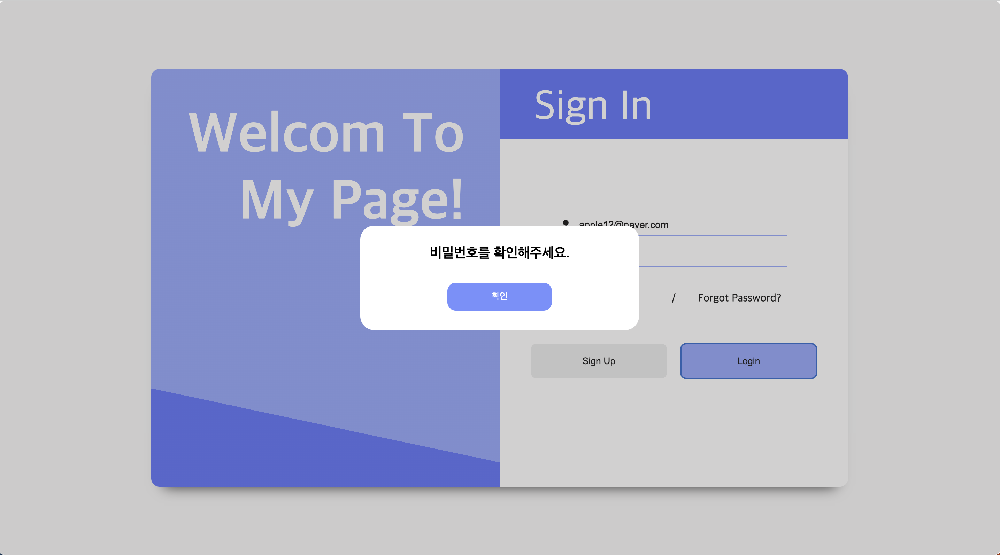
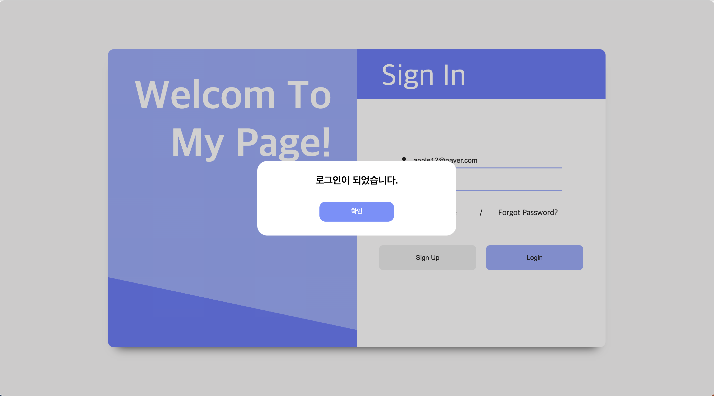

# 🖥️ 모달 화면 구현

## `✏️ 이런 저런 이야기`

로그인 화면에서 아이디와 비밀번호를 검증하고 올바른 형식인지 알기위한 창을 구현하기 위해 모달을 생각하였다.

모달은 기존 브라우저에 새로운 레이어를 띄우는 것을 의미한다.

모달창 말고 팝업창도 있는데 팝업창은 열려있는 브라우저창이 아닌 새로운 브라우저창 띄우는 것이다. 


### 컴포넌트 구성

기존 배경도 반투명하게 만들기위해 모달컴포넌트를 상단에 위치하였다. 후에 조건부렌더링을 통해 버튼이 클릭되었을 때 실행되게 만들었다.

모달 컴포넌트 안에서는 배경을 반투명하고 어둡게 만들 백그라운드와 모달창에 나타낼 박스를 만들고 그안에 텍스트와 버튼을 만들었다.

아이디와 비밀번호를 검증하여 상태를 알려주는 텍스트를 통해 잘못된 입력값이 있는지 확인하고 버튼을 통해 모달창을 끄는 형식이다.

모달은 position의 absolute를 통해 부모의 절대값으로 만들어 주었다. z-index 옵션을 통하여 기존 로그인 컴포넌트보다 위에 표시되게 하였다.


## `💻 구성한 코드 - Login.tsx`

```tsx
import React, { useState } from "react";
import styled from "styled-components";
import { FontAwesomeIcon } from "@fortawesome/react-fontawesome";
import { faUser } from "@fortawesome/free-solid-svg-icons";
import { faLock } from "@fortawesome/free-solid-svg-icons";
import { Link } from "react-router-dom";
import { useNavigate } from "react-router-dom";
import Modal from "./Modal";

interface InputTextType {
  loginSucces: String;
  idFailed: String;
  pwFailed: String;
}

function Login() {
  const [userId, setUserId] = useState<string>("");
  const [password, setPassword] = useState<string>("");
  const [isModal, setIsModal] = useState<boolean>(false);
  const [inputTextStr, setInputTextStr] = useState<String>("");
  const navigate = useNavigate();

  const inputTextObj: InputTextType = {
    loginSucces: "로그인이 되었습니다.",
    idFailed: "이메일 형식을 확인해주세요!",
    pwFailed: "비밀번호를 확인해주세요.",
  };

  const onChangeId = (e: React.ChangeEvent<HTMLInputElement>) => {
    setUserId(String(e.target.value));
  };

  const onChangePw = (e: React.ChangeEvent<HTMLInputElement>) => {
    setPassword(e.target.value);
  };

  const onClickSignUp = () => {
    navigate(`/signup`);
  };

  const isValid = () => {
    //eslint-disable-next-line
    const emailRegex =
      /^(([^<>()\[\].,;:\s@"]+(\.[^<>()\[\].,;:\s@"]+)*)|(".+"))@(([^<>()[\].,;:\s@"]+\.)+[^<>()[\].,;:\s@"]{2,})$/i;
    // eslint-disable-next-line
    const passWordRegex =
      /^(?=.*[A-Za-z])(?=.*\d)(?=.*[@$!%*#?&])[A-Za-z\d@$!%*#?&]{8,}$/;

    return emailRegex.test(userId)
      ? passWordRegex.test(password)
        ? (setModal(true), setInputTextStr(inputTextObj.loginSucces))
        : (setModal(true), setInputTextStr(inputTextObj.pwFailed))
      : (setIsModal(true), setInputTextStr(inputTextObj.idFailed));
  };

  const setModal = (isbool: boolean) => {
    setIsModal(isbool);
  };

  return (
    <>
      <Background>
        {isModal && <Modal setModal={setModal}>{inputTextStr}</Modal>}
        <Container>
          <LoginImg>
            <IntroContents>Welcom To My Page!</IntroContents>
          </LoginImg>
          <LoginContainer>
            <ContentTitle>Sign In</ContentTitle>
            <FormWrapper>
              <Label>
                <FontAwesomeIcon icon={faUser} />
                <InputId
                  type="email"
                  onChange={onChangeId}
                  placeholder="Username"
                ></InputId>
              </Label>
              <Label>
                <FontAwesomeIcon icon={faLock} />
                <InputPw
                  type="password"
                  onChange={onChangePw}
                  placeholder="Password"
                ></InputPw>
              </Label>
            </FormWrapper>
            <TextWrapper>
              <Label>
                <RememberCheckBox type="checkbox" name="xxx" value="yyy" />
                Remember Me
              </Label>
              {"/"}
              <PasswordFind to="/findpassword">Forgot Password?</PasswordFind>
            </TextWrapper>
            <ButtonWrapper>
              <SignUpBtn type="button" onClick={onClickSignUp} color="#eaeaea">
                Sign Up
              </SignUpBtn>
              <LoginBtn type="button" onClick={isValid} color="#88a0ff">
                Login
              </LoginBtn>
            </ButtonWrapper>
          </LoginContainer>
        </Container>
      </Background>
    </>
  );
}

const FlexRow = styled.div`
  display: flex;
  flex-direction: row;
`;

const FlexColumn = styled.div`
  display: flex;
  flex-direction: column;
`;

const Input = styled.input`
  font-size: 14px;
  margin-left: 10px;
  width: 300px;
  height: 30px;
  border: none;
  border-bottom: 2px solid #88a0ff;
  :focus {
    outline: none;
    border-bottom: 4px solid #4e68fc;
  }
`;

const Button = styled.button`
  margin: 10px;
  width: 195px;
  height: 50px;
  background-color: ${(props) => props.color};
  border: none;
  border-radius: 8px;
`;

const Background = styled.div`
  height: 100vh;
  background-color: #f8f8f8;
`;

const Container = styled(FlexRow)`
  position: absolute; // 위치 지정
  top: 50%;
  left: 50%;
  transform: translate(-50%, -50%);
  width: 1000px;
  height: 600px;
  background-color: #ffffff;
  border-radius: 12px;
  box-shadow: 0 17px 20px -18px rgba(0, 0, 0, 1);
`;

const LoginImg = styled.div`
  flex: 1;
  background: linear-gradient(12deg, #4e68fc 20%, #88a0ff 0%);
  border-radius: 12px 0px 0px 12px;
`;

const IntroContents = styled.h1`
  color: white;
  margin: 50px 50px 0px 0px;
  font-weight: 700;
  font-size: 80px;
  border-radius: 0px 12px 12px 0px;
  text-align: right;
`;

const LoginContainer = styled(FlexColumn)`
  flex: 1;
  align-items: center;
`;

const ContentTitle = styled.p`
  width: 100%;
  height: 100px;
  margin-top: 0;
  padding: 20px 0px 0px 50px;
  box-sizing: border-box;
  background-color: #4e68fc;
  color: white;
  font-size: 60px;
  border-radius: 0px 12px 0px 0px;
`;

const FormWrapper = styled.form`
  display: flex;
  flex-direction: column;
  margin-top: 50px;
  height: 100px;
`;

const Label = styled.label`
  display: flex;
  justify-content: center;
  align-items: center;
  margin-bottom: 15px;
`;

const InputId = styled(Input)``;

const InputPw = styled(Input)``;

const TextWrapper = styled(FlexRow)`
  justify-content: space-around;
  margin-top: 10px;
  width: 400px;

  Label {
    width: 150px;
  }
`;

const RememberCheckBox = styled.input`
  margin-right: 5px;
  font-size: 16px;
  text-decoration: none;
`;

const PasswordFind = styled(Link)`
  font-size: 16px;
  text-decoration: none;
  width: 150px;
  color: black;
`;

const ButtonWrapper = styled.div`
  margin-top: 30px;
`;

const SignUpBtn = styled(Button)`
  :hover {
    background-color: #dddddd;
    cursor: pointer;
  }
`;

const LoginBtn = styled(Button)`
  :hover {
    background-color: #7691ff;
    cursor: pointer;
  }
`;

export default Login;
```

> 로그인 버튼을 클릭하면 isValid 함수를 호출하여 입력된 아이디와 비밀번호에 대한 검증을 한다. 삼항연산자를 통해 기존 만들었 inputTextObj 객체에 있는 텍스트를 나타낸다. 후에 isModal의 값을 true로 설정하여 모달화면을 보이게 한다.


## `💻 구성한 코드 - modal.tsx`

```tsx
import React, { ReactNode } from "react";
import styled from "styled-components";

interface Props {
  setModal(isbool: boolean): void;
  children?: ReactNode;
}

export default function Modal({ setModal, children }: Props) {
  return (
    <>
      <ModalBackground>
        <ModalBox>
          {children}
          <ModalBtn onClick={() => setModal(false)}>확인</ModalBtn>
        </ModalBox>
      </ModalBackground>
    </>
  );
}

const ModalBackground = styled.div`
  z-index: 5;
  position: absolute;
  top: 0px;
  left: 0px;
  width: 100%;
  height: 100%;
  background-color: rgba(102, 100, 100, 0.3);
  display: flex;
  justify-content: center;
  align-items: center;
  border-radius: 12px;
`;

const ModalBox = styled.div`
  position: relative;
  width: 400px;
  height: 150px;
  z-index: 10;
  background-color: white;
  font-size: 20px;
  font-weight: 600;
  border-radius: 20px;
  display: flex;
  flex-direction: column;
  justify-content: center;
  align-items: center;
`;
const ModalBtn = styled.button`
  color: white;
  margin-top: 30px;
  width: 150px;
  height: 40px;
  border: none;
  border-radius: 12px;
  background-color: #7691ff;
  cursor: pointer;
`;
```

> setModal 함수와 inputTextObj의 상황에 맞는 텍스트를 children으로 받아 사용하였다.


## `🌃 구현된 화면`

### 이메일 형식이 틀린 경우


### 비밀번호 형식이 틀린경우



### 아이디와 비밀번호 형식이 올바른 경우




## `❓ 궁금한 내용이나 잘 이해되지 않는 내용`

